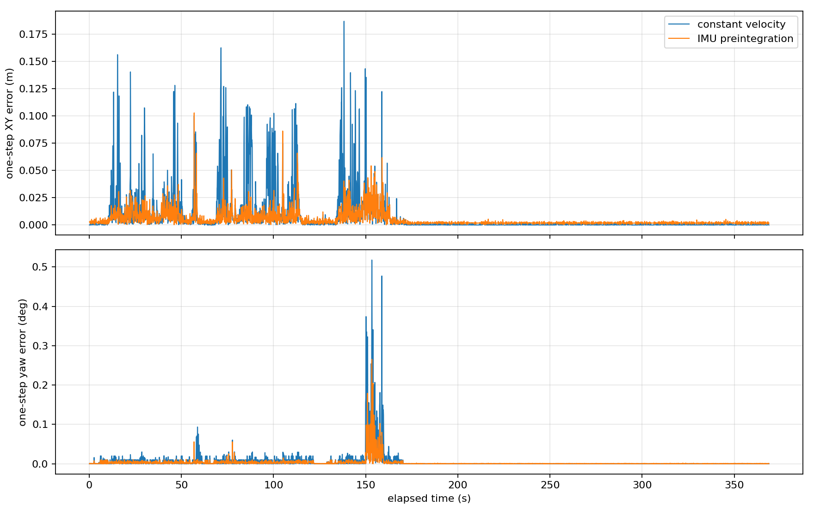
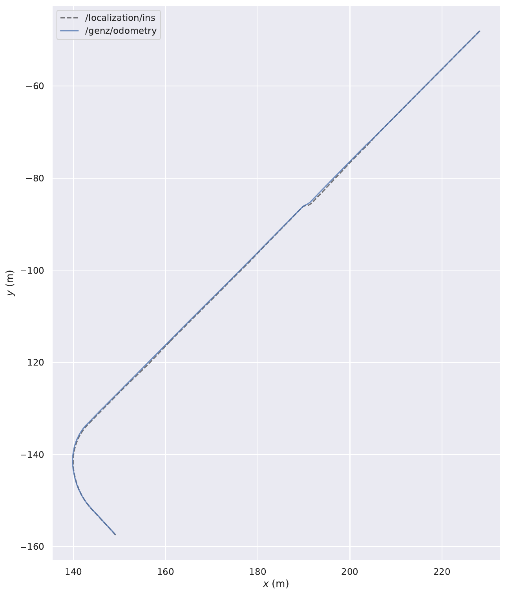
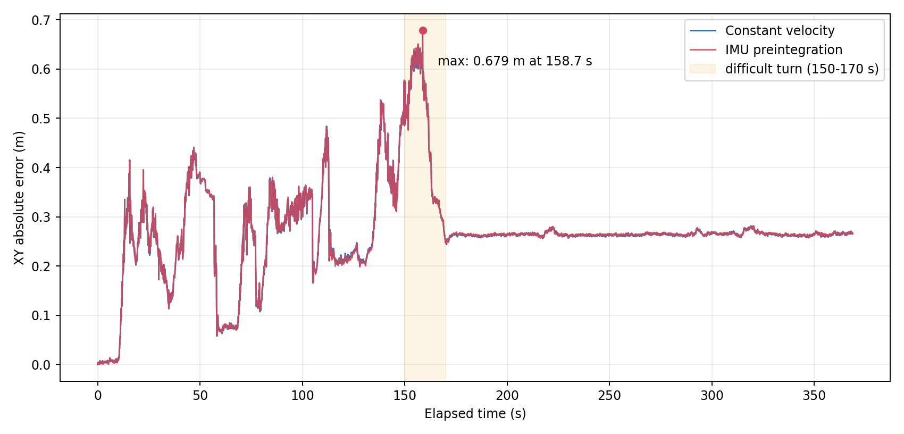

# LocLIO IMU 预测实现与初步验证

日期：2026-06-21  
数据：`/home/guoli/data/yangpu/loc/merged_bag.bag`

## 1. 目标

`Loc_LO` 原本使用最近两帧 ICP pose 的恒速模型预测下一帧：

```text
T_prediction = T_(k-1) * (T_(k-2)^-1 * T_(k-1))
```

`Loc_LIO` 现在可以订阅 `/ins_driver/imu`，在相邻 LiDAR 帧之间积分角速度和线加速度，用 IMU pose 作为 GenZ-ICP 的本帧 absolute initial guess。ICP 完成后再用配准结果校正 pose 和速度状态。

这是一种“IMU 预测 + LiDAR ICP 校正”的松耦合实现，不是包含 bias、协方差和误差状态卡尔曼滤波的完整紧耦合 LIO。

## 2. 数据与假设

| 项目 | 数值 |
| --- | --- |
| IMU 话题 | `/ins_driver/imu` |
| IMU 频率 | 约 100 Hz |
| 点云频率 | 约 10 Hz |
| IMU frame | `chcnav_msg_parser` |
| 点云 frame | `base_link` |
| IMU 到 base 外参 | 单位矩阵 |
| 原始加速度模长 | 约 1.0 |
| 默认加速度比例 | 9.80665 |

虽然消息类型是 `sensor_msgs/Imu`，当前驱动的静止加速度模长约为 1，而不是 9.81，因此默认通过 `imu_accel_scale=9.80665` 转成 m/s²。

## 3. 实现流程

```text
IMU 100 Hz
  -> 缓存 angular_velocity / linear_acceleration
  -> 从上一帧 ICP 时间积分到当前 LiDAR 时间
  -> gyro 更新姿态
  -> acceleration 旋转到世界系并去重力
  -> 更新速度和位置
  -> 得到 /genz/imu_prediction
  -> 作为 GenZ-ICP absolute initial guess
  -> ICP scan-to-local-map 校正
  -> 用 ICP pose 校正 IMU pose 和世界系速度
```

核心约束：

- 单个 IMU 时间间隔超过 `imu_max_sample_gap` 时拒绝预测。
- LiDAR 帧间隔超过 `imu_max_prediction_interval` 时拒绝预测。
- 加速度或角速度超过配置上限时拒绝预测。
- IMU 不可用时默认回退到原恒速模型。
- 可设置 `imu_fallback_to_constant_velocity=false`，改为零运动初值回退。

## 4. 新增接口与输出

`GenZICP` 新增接受外部绝对初值的接口：

```cpp
RegisterFrame(frame, timestamps, initial_guess);
```

原有两参数接口保持不变，`Loc_LO` 和 `OdometryServer` 仍使用内部恒速模型。

新增调试输出：

```text
/genz/imu_prediction
```

RViz 中：

- 青色箭头：IMU 预测的 ICP 初值。
- 红色箭头：GenZ-ICP 校正后的当前 pose。

## 5. 离线一帧预测对比

实现初期先进行了不依赖 ROS master 的单步预测检查。本节只评价相邻 LiDAR 帧之间的 initial guess，不代表整段 LIO 最终轨迹精度；完整轨迹结果见第 9 节。

为了先验证预测模型，使用 INS pose 作为每帧起点和下一帧参考，对全部 3687 个 LiDAR 间隔比较恒速预测与单位外参 IMU 预积分预测。

### 5.1 全部路段

| 指标 | 恒速模型 | IMU 预积分 |
| --- | ---: | ---: |
| 3D 位置 RMSE | 0.02112 m | 0.00844 m |
| XY RMSE | 0.02108 m | 0.00833 m |
| XY P95 | 0.04622 m | 0.01792 m |
| 旋转角 RMSE | 0.04409 deg | 0.03482 deg |
| yaw RMSE | 0.02519 deg | 0.01201 deg |
| yaw 最大误差 | 0.51770 deg | 0.26533 deg |

### 5.2 转弯路段

以角速度模长大于 0.05 rad/s 选出 98 个转弯帧：

| 指标 | 恒速模型 | IMU 预积分 |
| --- | ---: | ---: |
| XY RMSE | 0.03013 m | 0.02213 m |
| XY P95 | 0.05121 m | 0.03959 m |
| yaw RMSE | 0.14654 deg | 0.07120 deg |
| yaw P95 | 0.33635 deg | 0.14091 deg |

预测误差曲线：



逐帧结果：

```text
docs/assets/loc_lio_prediction_comparison.csv
```

初步结论：IMU 预测在这份数据上明显改善了下一帧 initial guess，收益主要出现在车辆转弯和运动状态变化处。但第 9 节完整 EVO 表明，这个优势没有转化为最终轨迹精度提升。

## 6. 编译与运行

正常工作区编译：

```bash
source /opt/ros/noetic/setup.bash
cd /home/guoli/proj/genz-icp_ws
catkin build genz_icp --cmake-args -DCMAKE_BUILD_TYPE=Release
source devel/setup.bash
```

启动 LocLIO：

```bash
roslaunch genz_icp loc_lio.launch \
  rviz:=true \
  visualize:=true \
  record:=true \
  use_imu_prediction:=true \
  refine_ins_init:=false
```

另一个终端播放：

```bash
rosbag play /home/guoli/data/yangpu/loc/merged_bag.bag --clock
```

关闭 IMU、恢复恒速模型做 A/B：

```bash
roslaunch genz_icp loc_lio.launch \
  rviz:=false \
  visualize:=false \
  record:=true \
  record_bag:=/home/guoli/data/yangpu/loc/loc_lio_constant_velocity_eval.bag \
  use_imu_prediction:=false \
  refine_ins_init:=false
```

## 7. evo 命令

默认 IMU 版本评估 bag：

```text
/home/guoli/data/yangpu/loc/loc_lio_imu_eval.bag
```

XY APE：

```bash
evo_ape bag /home/guoli/data/yangpu/loc/loc_lio_imu_eval.bag \
  /localization/ins /genz/odometry \
  --pose_relation trans_part \
  --project_to_plane xy
```

1m RPE：

```bash
evo_rpe bag /home/guoli/data/yangpu/loc/loc_lio_imu_eval.bag \
  /localization/ins /genz/odometry \
  --pose_relation trans_part \
  --delta 1 \
  --delta_unit m
```

## 8. 当前边界

- IMU bias 暂未在线估计；每帧 ICP 校正限制了短期影响，但不是完整解决方案。
- 外参按单位矩阵实现。如果 `chcnav_msg_parser` 与 `base_link` 实际轴向不同，需要换成标定外参。
- 加速度单位根据当前 bag 推断为 g；更换驱动后要确认 `imu_accel_scale`。
- 当前没有把 IMU 用于点级 deskew，只用于帧间 pose initial guess。
- `/localization/ins` 的 child frame 是 `map_harbor`，和 `base_link` 做 evo 前仍需统一参考点。

## 9. 完整轨迹 evo 评估

### 9.1 测试方法

测试日期：2026-06-21。

输入仍为：

```text
/home/guoli/data/yangpu/loc/merged_bag.bag
```

本次执行环境禁止 ROS master 创建本地 XML-RPC 端口，因此使用新增的 `offline_lio_eval` 顺序读取同一 bag，直接调用与在线 `Loc_LIO.cpp` 相同的 GenZ-ICP 和 IMU 预积分逻辑。该方式不经过 ROS 发布队列，可以确定性处理全部点云。

测试参数与 `loc_lio.launch` 默认值一致：

| 参数 | 数值 |
| --- | --- |
| 初始化 | 第一帧 raw INS pose |
| 全局地图精匹配 | 关闭 |
| IMU 外参 | 单位矩阵 |
| 加速度比例 | 9.80665 |
| 重力 | 9.80665 m/s² |
| 点云配置 | `outdoor.yaml` |
| 点云帧数 | 3689 |
| IMU 预测成功 | 3688 |
| IMU 回退 | 0 |

为了排除旧 LO 实时测试丢帧的影响，还用完全相同的离线程序、相同 3689 帧点云关闭 IMU，重新得到一条匀速模型基线。因此“离线匀速”和“离线 IMU”是本节最公平的 A/B；旧 LO 在线结果仅作历史参考。

离线复现命令：

```bash
offline_lio_eval /home/guoli/data/yangpu/loc/merged_bag.bag \
  /tmp/loc_lio_imu_eval.bag

offline_lio_eval /home/guoli/data/yangpu/loc/merged_bag.bag \
  /tmp/loc_lio_cv_eval.bag --constant-velocity
```

### 9.2 EVO 结果

两条轨迹均未使用 EVO 对齐或尺度修正，参考轨迹为 `/localization/ins`，估计轨迹为 `/genz/odometry`。

| 指标 | 旧 LO 在线匀速（3668 帧） | 离线匀速（3689 帧） | 离线 LIO IMU（3689 帧） |
| --- | ---: | ---: | ---: |
| APE 3D RMSE | 0.440420 m | 0.447167 m | **0.458609 m** |
| APE XY RMSE | 0.285017 m | 0.287029 m | **0.287613 m** |
| RPE 1m RMSE | 0.056767 m | 0.056857 m | **0.060241 m** |
| APE XY 最大值 | 0.672690 m | 0.677695 m | **0.678770 m** |
| 估计路径长度 | 159.175 m | 159.498 m | **159.883 m** |
| INS 路径长度 | 152.089 m | 152.089 m | **152.089 m** |

LIO 详细统计：

| 指标 | RMSE | mean | median | std | min | max |
| --- | ---: | ---: | ---: | ---: | ---: | ---: |
| APE 3D | 0.458609 | 0.428848 | 0.537528 | 0.162517 | 0.001000 | 0.723370 |
| APE XY | 0.287613 | 0.270886 | 0.264810 | 0.096656 | 0.000000 | 0.678770 |
| RPE 1m | 0.060241 | 0.044426 | 0.033496 | 0.040686 | 0.003590 | 0.338045 |

与严格离线匀速基线相比：

- LIO 的 XY APE 增加约 0.20%，基本持平。
- LIO 的 3D APE 增加约 2.56%。
- LIO 的 1m RPE 增加约 5.95%，短距离相对误差反而略有恶化。
- LIO 路径比匀速版长 0.385 m，也比 INS 参考轨迹长 7.794 m。

因此，本次完整轨迹测试不能得出“IMU 提高最终定位精度”的结论。当前实现改善了单步 initial guess，但最终 ICP 轨迹与匀速版本非常接近，并且整体指标略差。

### 9.3 轨迹与误差位置

LIO 的 EVO XY 轨迹如下，灰色虚线为 INS，蓝色实线为 LIO：



IMU 与匀速版本的逐帧 XY 绝对误差：



两种模型的最大 XY 误差都发生在启动后 `158.700 s`，对应绝对时间戳 `1781078691.298935`，仍是之前 LO 报告中发现的左下方弯道路段：

| 指标 | 匀速 | IMU |
| --- | ---: | ---: |
| 150–170 s XY RMSE | 0.492421 m | 0.493623 m |
| 最大 XY 误差 | 0.677695 m | 0.678770 m |
| 最大误差时刻 | 158.700 s | 158.700 s |

LIO 在该峰值处的误差向量约为 `[-0.403, +0.546, -0.250] m`。最大误差时刻没有被 IMU 改变，说明该峰值的主要原因仍是弯道路段的 LiDAR 几何约束和 ICP 局部匹配，而不是匀速模型没有给出初值。

### 9.4 高度误差

按最近时间戳匹配 INS 与 LIO，最大同步差限制为 0.05 s：

| 指标 | 离线匀速 | 离线 LIO IMU |
| --- | ---: | ---: |
| 匹配位姿数 | 3689 | 3689 |
| Z signed mean | -0.267240 m | -0.280943 m |
| Z RMSE | 0.343459 m | 0.357813 m |
| XYZ RMSE | 0.447831 m | 0.459298 m |

3D 指标变差主要来自 LIO 的负向 Z 偏差略有增加。当前实现直接积分未经 bias 估计的加速度，并假定单位外参、固定重力方向；很小的重力投影或零偏误差就会先进入位置初值，随后影响 ICP 收敛结果。

### 9.5 原因与改进方向

单步预测更准但完整轨迹没有变好的主要原因是：

1. IMU 只提供 ICP 初值，不参与残差优化。大多数帧中两种初值最终会收敛到同一个 ICP 局部最优解。
2. 当前没有估计陀螺仪和加速度计 bias，也没有静止重力初始化；位置积分特别容易受 Z 方向误差影响。
3. IMU 到 `base_link` 暂按单位矩阵。如果实际轴向或杆臂不为零，转弯时预测会带入系统误差。
4. `imu_velocity_correction_gain=1.0`，每帧速度完全由 ICP 位移重置，IMU 速度状态不连续，尚未形成真正的融合约束。
5. 点云 `deskew=false`，IMU 没有修正一帧扫描内部的运动畸变，因此转弯困难段的点云几何本身没有改善。

下一步优先级建议：先标定 IMU 外参和加速度单位，加入启动阶段重力与 bias 初始化；然后做点级 deskew。完成这些基础项后，再考虑 ESKF 或滑窗优化，把 IMU 残差真正加入状态估计，而不只是替换 ICP initial guess。
