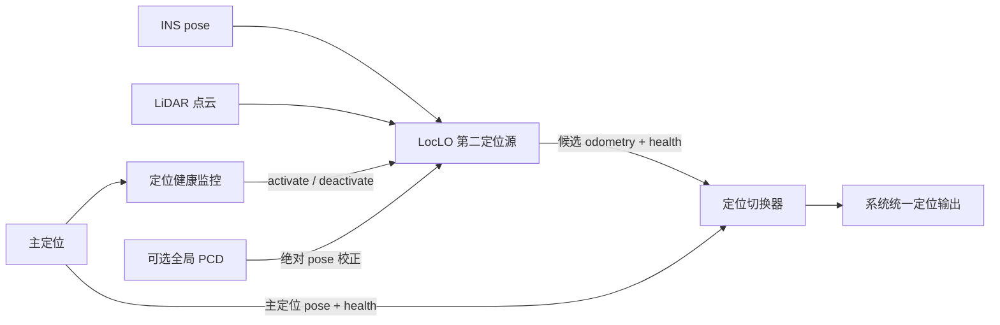

# LocLO 算法分析与第二定位源集成方案

日期：2026-06-21  
测试对象：`loc_lo_node`  
测试数据：`/home/guoli/data/yangpu/loc/merged_bag.bag`  
资源隔离复测日期：2026-06-21

## 0. 汇报结论

LocLO 是基于 GenZ-ICP 的 LiDAR 里程计：使用 INS 提供启动时的绝对初值，后续依靠匀速模型、当前点云与滚动局部地图完成连续定位。它不依赖外部全局地图，内存和磁盘开销较低，能够基本实时处理 10 Hz 点云，适合作为主定位失效后的短时第二定位源。

当前方案的主要限制是：后续没有绝对位置约束，误差会累计；在开阔道路、长直路、急转弯、动态目标较多或点云中断时可能退化；错误配准还可能污染局部地图。因此不建议把 LocLO 作为无健康监控、可无限时运行的独立全局定位源。

推荐采用“常驻待命、按需激活、质量门控、有限时接管”的集成方式：主定位失效后发出激活命令，LocLO 使用经过校验并转换到 `base_link` 的最新 INS pose 初始化；连续多帧匹配健康后，由定位切换器接管其输出。运行中可按条件引入 INS 或全局地图匹配得到的绝对 pose，抑制累计漂移。

## 1. 算法定位与流程

LocLO 当前流程：

```text
首帧 INS pose
      ↓
初始化 GenZ-ICP 全局位姿
      ↓
点云预处理、距离裁剪、体素降采样
      ↓
匀速模型预测当前位姿
      ↓
当前点云与滚动局部地图做 GenZ-ICP 配准
      ↓
输出 /genz/odometry
      ↓
将配准后的点云加入局部地图，并清理远处体素
```

LocLO 本质上是局部 LiDAR 里程计，不是完整 SLAM 或全局地图定位：

- 第一帧 INS 提供绝对坐标起点。
- 后续 INS 默认不参与位姿修正。
- 没有回环、GNSS/INS 因子或全局优化。
- 局部地图由历史配准点云在线构建，会随车辆移动滚动维护。

## 2. 资源占用

### 2.1 测试条件

测试关闭 RViz、调试点云、全局地图和录包，只保留算法本体：

```bash
roslaunch --skip-log-check genz_icp loc_lo.launch \
  visualize:=false \
  publish_global_map:=false \
  refine_ins_init:=false \
  publish_odom_tf:=false \
  record:=false
```

数据时长 368.9 s，点云 3689 帧、约 10 Hz；配置为 `voxel_size=0.6`、目标体素点数 3000、ICP 最大迭代 100 次。隔离复测额外明确设置 `refine_ins_init=false` 和 `publish_odom_tf=false`，确认不加载 PCD、不执行 NDT/GenZ 全局地图初始化匹配。

### 2.2 实测结果

| 项目 | 实测结果 | 判断 |
| --- | ---: | --- |
| 平均输出频率（首次测试） | 9.935 Hz | 基本跟上 10 Hz 输入 |
| 最大输出间隔（首次测试） | 0.319 s | 个别帧存在明显抖动 |
| 平均 CPU | 235.96% | 平均约占用 2.36 核 |
| CPU P95 | 463.35% | 95% 的 1 秒样本不超过约 4.63 核 |
| CPU P99 | 615.61% | 99% 的 1 秒样本不超过约 6.16 核 |
| 峰值 CPU | 713% | 单秒瞬时约 7.13 核 |
| 平均 RSS | 约 110.5 MB | 较低 |
| 峰值 RSS | 约 134.7 MB | 可控 |
| 节点磁盘 IO | 接近 0 | 非瓶颈 |

### 2.3 资源结论

1. 主要瓶颈是 CPU，不是内存和磁盘。
2. 复测期间整机平均 CPU 空闲率为 86.04%，最低仍有 58.69%，没有其他高负载程序明显干扰。
3. 本次明确关闭外部地图加载和精匹配，仍测得 713% 峰值；原报告的 780% 不是加载地图造成的。
4. CPU 峰值主要来自 ICP 对应点搜索、TBB 并行线性系统构建、点云转换、体素化和在线局部地图更新。在线局部地图属于 LO 核心状态，与外部 PCD 地图不同。
5. 平均性能满足当前 10 Hz 数据，但首次测试中 319 ms 的最大间隔意味着系统负载升高时可能丢帧或增加定位延迟。
6. 上述结果不包含 RViz、调试点云、全局地图加载和录包；量产运行应默认关闭这些功能。

### 2.4 当前精度参考

仅使用首帧 INS 初始化时，EVO 结果为：

| 指标 | 结果 |
| --- | ---: |
| APE 3D RMSE | 0.440 m |
| APE XY RMSE | 0.285 m |
| RPE 1m RMSE | 0.057 m |
| 最大 XY 误差 | 0.673 m |

这组结果说明短距离相对运动较稳定，但不能直接作为量产精度结论：当前 INS 的 child frame 为 `map_harbor`，点云和 LocLO 输出接近 `base_link`，两者缺少已确认的杆臂外参转换；EVO 会把参考点和高度基准差异计入误差。

## 3. Corner Case 与算法边界

| 场景或边界 | 可能表现 | 原因与风险 |
| --- | --- | --- |
| 长时间纯里程计运行 | 位置和航向逐渐漂移 | 没有绝对 pose、回环或全局地图约束，误差只能累计 |
| 长直路、开阔道路、结构单一区域 | 横向或航向不稳定 | 点云几何约束不足，ICP 某些自由度不可观 |
| 隧道、护栏等重复结构 | 匹配到错误位置但分数仍可能较高 | 局部几何相似，单一匹配分数无法证明全局正确 |
| 急转弯、急加减速、高速行驶 | 初值偏差增大，局部误差出现峰值 | 匀速模型不满足真实运动；当前点云未做 IMU deskew |
| 行人、车辆等动态点较多 | 位姿抖动或地图拖影 | 动态点参与对应关系，并被写入局部地图 |
| 雨雾、灰尘、反射异常或点云稀疏 | 有效对应点下降，ICP 可能不收敛 | 输入点云质量下降，平面和非平面约束不足 |
| 点云延迟、中断、乱序或连续丢帧 | 预测跨度过大，恢复后跳变 | 匀速预测和局部地图都依赖连续时序 |
| INS 初值异常或时间不同步 | 整条轨迹具有初始偏差，严重时无法建立局部地图 | 当前初始化直接信任第一帧 INS pose |
| INS、LiDAR、地图坐标系不一致 | 固定平移、姿态或高度偏差 | `map_harbor`、`base_link` 和 PCD 基准未统一 |
| 某帧发生错误配准 | 后续误差持续扩大 | 错误 pose 对应的点云会写入局部地图，形成正反馈污染 |
| 车辆被搬运或定位瞬间跳变 | 原局部地图无法继续使用 | 当前地图和运动历史仍属于跳变前位置，需要显式重置 |
| CPU 与系统其他模块竞争 | 输出延迟、点云队列丢帧 | 峰值接近 8 核，当前订阅队列较小 |
| 依赖全局地图修正时驶出裁剪区域 | 地图匹配失效 | 固定半径裁剪地图不能覆盖完整行程，需要动态切片 |

其中最需要关注的共同困难路段是数据启动后约 150–165 s 的弯道。不同初始化方案都在约 158.7 s 出现最大 XY 误差，说明该处主要是局部场景几何、车辆转弯和点云运动畸变带来的共同问题。

## 4. 改进方向

### 4.1 P0：先补齐可用性与安全闭环

1. **统一坐标系和时间基准**

   标定并使用 `INS/map_harbor -> base_link -> LiDAR` 外参；所有初始化、绝对修正、输出和评估必须使用同一参考点。监控 INS 与点云时间差，过期数据不得用于初始化。

2. **输出定位健康状态**

   每帧至少输出：有效对应点数量和比例、ICP 残差、迭代次数、位姿增量、处理耗时、点云数量、输出延迟和退化标志。不能只用“节点仍在发布”判断定位有效。

3. **增加显式启动、停止和重置接口**

   激活时清空旧 pose、阈值状态和局部地图；退出接管或发生大跳变时也必须重置，禁止复用上一段任务污染后的地图。

4. **增加结果门限**

   对单帧平移、旋转、速度、加速度和匹配质量设置联合门限。异常帧不更新局部地图，连续异常则将 LocLO 标记为 `DEGRADED`。

### 4.2 P1：用绝对 pose 抑制累计误差

累计漂移可以通过两类绝对约束修正：

**方案 A：INS 绝对 pose 修正**

- 仅在 INS 状态有效、时间新鲜、协方差满足要求时使用。
- 比较 INS 与 LocLO 的位置和航向差，超过漂移阈值且连续多帧一致时才触发。
- 启动和严重失配恢复可使用硬重置；正常运行中应平滑修正，避免输出瞬跳。
- INS 不稳定时禁止用它覆盖 LocLO，可退化为只修正可信分量，例如 `x/y/yaw`。

**方案 B：全局地图匹配修正**

- 用当前 INS 或 LocLO pose 裁剪动态地图块，先粗匹配，再用 GenZ-ICP 精匹配。
- 只有对应点比例、残差、位姿改变量和地图覆盖率同时满足门限时才接受结果。
- 可按固定距离、固定时间、累计不确定度或退化事件触发，不必每帧匹配全局地图。
- 地图修正后必须同步变换或重建局部地图，否则新 pose 与旧局部地图不一致。

推荐优先采用“INS 提供搜索中心 + 局部 PCD 地图匹配确认”的双重约束。INS 负责把搜索范围限定在正确区域，地图匹配负责获得与环境一致的绝对 pose；任何单一分数都不能独立触发修正。

### 4.3 P1：提高退化场景鲁棒性

- 引入 Hessian 特征值、有效对应点空间分布等退化检测，识别不可观方向。
- 接入语义或几何动态点过滤，避免车辆和行人污染局部地图。
- 使用 IMU 做点级 deskew，优先改善急转弯和高速路段，而不只是替换 ICP 初值。
- 对点云断流设置超时；恢复后使用新绝对 pose 重启，不跨长时间间隔继续外推。
- 错误匹配帧禁止更新地图，连续健康若干帧后再恢复地图写入。

### 4.4 P2：降低资源峰值

- 根据场景和 CPU 负载动态调整目标体素点数，建议对 3000、2000、1500 做精度与资源 A/B。
- 测试将 `voxel_size` 从 0.6 m 增至 0.8 m，以及将最大迭代从 100 降至 60。
- 记录每帧预处理、对应点搜索、求解和地图更新耗时，针对峰值阶段优化。
- 量产默认关闭 RViz、全局地图发布、调试点云和终端状态条；评估录包只保存 pose 与健康状态。

## 5. 第二定位源集成方案

### 5.1 总体原则

LocLO 作为第二定位源时，不直接抢占系统标准定位话题。LocLO 发布候选位姿和健康状态，由独立的 `localization_switcher` 决定使用主定位还是 LocLO。这样可以避免两个节点同时发布同一话题，也便于实现切换门限、回切和故障追踪。

推荐采用**常驻待命、计算按需启动**：LocLO 进程始终在线并缓存最新 INS、点云时间和健康信息，但待命时不执行 ICP。这样既减少平时 CPU 消耗，也避免主定位失效后再启动进程造成额外延迟。

需要说明：当前 `Loc_LO.cpp` 启动后会直接处理点云，尚未实现激活命令、待命状态、READY 应答和运行中重置。以下内容是建议的工程集成设计，不是对现有功能的描述。



### 5.2 状态机

| 状态 | 行为 | 转移条件 |
| --- | --- | --- |
| `STANDBY` | 节点常驻，缓存最新 INS，不运行 ICP | 收到激活命令且输入数据有效 |
| `INITIALIZING` | 校验并转换 INS pose，清空历史状态，建立首帧局部地图 | 连续若干帧匹配健康后进入 `ACTIVE` |
| `ACTIVE` | 输出候选位姿，维护局部地图和健康状态 | 连续异常进入 `DEGRADED`；收到退出命令进入 `STANDBY` |
| `DEGRADED` | 停止更新地图，尝试 INS/全局地图重定位 | 重定位成功回到 `INITIALIZING`；超时则报告不可用 |

不建议收到一个布尔激活信号后立即切换输出。建议 LocLO 与切换器之间采用“两阶段切换”：先激活 LocLO，待其连续 5–10 帧健康且与当前可用参考无明显跳变后，再确认接管。

### 5.3 激活流程

```text
1. 主定位健康监控检测到连续失效
2. 发布 LocLO 激活命令，包含时间戳、失效原因和期望初始坐标系
3. LocLO 检查 LiDAR 是否连续、INS 是否新鲜且状态有效
4. 将最新 INS pose 从 map_harbor 正确转换为 map -> base_link
5. 清空旧轨迹、局部地图和自适应阈值，设置初始 pose
6. 处理当前点云并建立局部地图
7. 连续多帧通过匹配质量、频率和位姿跳变门限
8. LocLO 报告 READY，切换器将系统输出切到 LocLO
```

如果 INS 本身也是主定位故障的一部分，不能无条件采用其 pose。此时应按优先级选择初始化来源：

```text
有效 INS pose
  → INS 初值 + 全局地图匹配确认
  → 其他可用绝对定位 pose
  → 无可靠初值时拒绝进入 ACTIVE
```

### 5.4 运行与回切策略

- LocLO 接管期间持续发布自身健康度和累计运行距离/时间。
- 达到漂移风险阈值、匹配退化或绝对修正失败时，向系统报告不可用，不输出“看起来连续但不可信”的 pose。
- 主定位恢复后需稳定一段时间并通过与 LocLO 的一致性检查，再执行回切，防止频繁来回切换。
- 切换瞬间由 `localization_switcher` 计算坐标偏置并进行短时平滑，避免控制模块收到位置或航向突跳。
- 回切完成后 LocLO 返回 `STANDBY` 并清空本次局部地图，等待下一次激活。

### 5.5 建议接口

| 接口 | 建议内容 |
| --- | --- |
| 激活命令 | `activate`、时间戳、故障原因、初始化来源 |
| LocLO 候选输出 | 独立话题，例如 `/localization/loc_lo/odometry` |
| 健康状态 | 状态机、匹配分数、对应点数、残差、延迟、连续成功/失败计数 |
| READY 应答 | 初始化完成且连续多帧健康，可由切换器接管 |
| 重置服务 | 清空轨迹、局部地图、运动模型和初始 pose |
| 绝对修正输入 | 带来源、协方差、时间戳和坐标系的 pose |

## 6. 实施计划与验收

### 第一阶段：可接入

- 增加激活、停用、重置和状态机。
- 输出独立候选 odometry 与健康状态。
- 完成 INS、LiDAR、`base_link` 外参和时间同步。
- 验证待命 CPU 接近零，激活后首个 READY 延迟可控。

### 第二阶段：可安全切换

- 实现连续帧质量门控、退化检测和地图污染保护。
- 接入 `localization_switcher`，完成主定位失效、LocLO 接管、主定位恢复回切测试。
- 注入 INS 异常、点云中断、CPU 满载和时间戳异常，确认系统会拒绝错误切换。

### 第三阶段：控制累计漂移

- 接入经过校验的 INS 绝对修正。
- 接入局部裁剪的全局地图匹配，建立粗匹配、精匹配和接受门限。
- 在直路、弯道、动态交通、弱结构区域和长距离运行中统计接管成功率、最大误差和失效检测时间。

建议验收指标至少包含：接管成功率、激活到 READY 延迟、错误切换次数、连续输出频率、95/99 分位处理耗时、最大定位跳变、接管期间 APE/RPE、可持续接管距离，以及退化后停止输出或恢复定位所需时间。

## 7. 最终建议

LocLO 具备成为第二定位源的基础条件：资源可控、短距离相对定位稳定、无需预加载全局地图。但上线前必须补齐坐标外参、健康度、状态机、地图污染保护和切换门控。

建议产品定位为：**主定位失效时的短时连续定位与安全降级能力**。在加入可靠绝对 pose 修正和全局重定位之前，不把它定义为可长期独立运行的全局定位方案。

详细原始测试数据见 [LocLO资源占用测试报告.md](LocLO资源占用测试报告.md)，精匹配与坐标系分析见 [LocLO精匹配裁剪地图测试报告.md](LocLO精匹配裁剪地图测试报告.md)。
