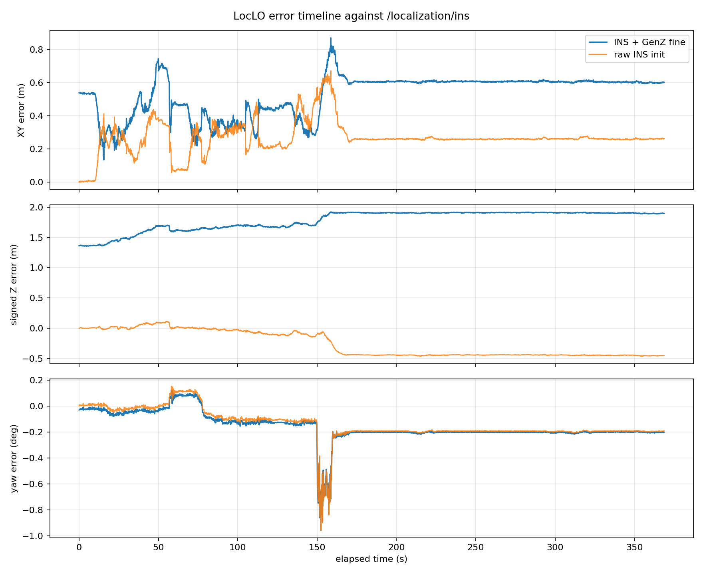
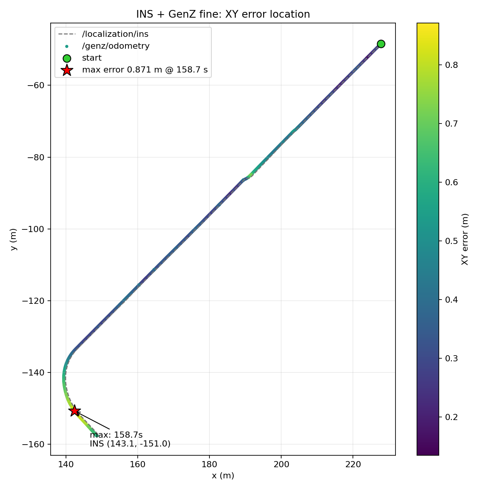

# LocLO 精匹配初始化与裁剪地图测试报告

测试日期：2026-06-20  
测试对象：`loc_lo_node`  
测试数据：`/home/guoli/data/yangpu/loc/merged_bag.bag`  
评估 bag：`/home/guoli/data/yangpu/loc/loc_lo_refined_crop_eval.bag`

## 1. 测试目的

本次测试评估当前 `Loc_LO.cpp` 的新初始化流程：

- 首帧使用 `/localization/ins` 作为初始猜测。
- 以首帧 INS 的 `xy` 为中心裁剪 PCD 地图。
- 用裁剪后的地图做 GenZ-ICP 精匹配初始化。
- 精匹配分数低时，再用 NDT 粗匹配 + GenZ-ICP 精匹配兜底。
- 初始化后按 OdometryServer/LocLO 的 LO 流程继续运行。

同时统计资源占用，并使用 `evo` 对 `/genz/odometry` 和 `/localization/ins` 做精度评估。

## 2. 测试配置

启动节点：

```bash
source /opt/ros/noetic/setup.bash
source /home/guoli/proj/genz-icp_ws/devel/setup.bash

roslaunch --skip-log-check genz_icp loc_lo.launch \
  rviz:=false \
  visualize:=false \
  publish_global_map:=false \
  record:=true \
  record_bag:=/home/guoli/data/yangpu/loc/loc_lo_refined_crop_eval.bag \
  refine_ins_init:=true \
  init_map_crop_radius:=160.0
```

播放数据：

```bash
rosbag play /home/guoli/data/yangpu/loc/merged_bag.bag --clock
```

关键参数：

| 参数 | 值 |
| --- | --- |
| `use_ins_init` | `true` |
| `refine_ins_init` | `true` |
| `init_map_crop_radius` | `160.0 m` |
| `init_ndt_map_voxel` | `1.0 m` |
| `init_scan_voxel` | `0.6 m` |
| `init_fine_score_threshold` | `0.35` |
| `init_min_correspondences` | `300` |
| `init_use_ndt_fallback` | `true` |
| `rviz` | `false` |
| `visualize` | `false` |
| `publish_global_map` | `false` |
| `record` | `true` |

输入 bag 信息：

| 项目 | 数值 |
| --- | --- |
| 时长 | 368.9 s |
| 文件大小 | 8.4 GB |
| 解压后数据量 | 26.5 GB |
| `/lidar_preprocessor/meta_cloud` | 3689 帧，约 10 Hz |
| `/localization/ins` | 33698 帧，约 91 Hz |

输出评估 bag：

| 话题 | 数量 |
| --- | --- |
| `/genz/odometry` | 3661 |
| `/localization/ins` | 33698 |

评估 bag 大小：27.5 MB。

## 3. 初始化结果

节点日志：

```text
Loading global map for init/RViz: /home/guoli/data/yangpu/loc/map.pcd, crop_radius=160, crop_center=228.173696,-48.089093
Global map loaded. finite points=4033523, cropped points=1392102, init map points=346867, voxel map points=346836, voxel cells=333995, map voxel leaf=1, crop_radius=160
Init fine align from INS: score=0.899099, corr=4990/5550
LocLO initialized by INS + GenZ fine, accepted=1, xyz= 227.748 -48.4207  1.31358, cloud stamp=1.78108e+09
```

结论：

- 地图原始有效点数：4033523。
- 按首帧 INS 周围 160 m 裁剪后：1392102 点。
- 再按 1.0 m 下采样后用于初始化匹配：346867 点。
- 相比之前全局下采样初始化地图约 1081857 点，本次初始化匹配地图降到约 32%。
- 首帧 GenZ 精匹配分数 `0.899099`，明显高于阈值 `0.35`，因此未触发 NDT 兜底。

## 4. 资源占用

采集命令：

```bash
pidstat -h -r -u -p <loc_lo_node_pid> 1
/usr/bin/time -v rosbag play /home/guoli/data/yangpu/loc/merged_bag.bag --clock
```

`loc_lo_node` 资源统计：

| 指标 | 数值 |
| --- | --- |
| 样本数 | 385 |
| 平均 CPU | 249.79% |
| CPU P50 | 240.00% |
| CPU P90 | 454.00% |
| CPU P95 | 519.00% |
| CPU P99 | 657.00% |
| 峰值 CPU | 795.00% |
| 用户态平均 | 220.09% |
| 系统态平均 | 29.71% |
| 平均 RSS | 210204 KB，约 205.3 MB |
| RSS P50 | 220968 KB，约 215.8 MB |
| RSS P95 | 240840 KB，约 235.2 MB |
| 峰值 RSS | 288692 KB，约 281.9 MB |
| 平均 VSZ | 2446878 KB，约 2.33 GB |
| 峰值 VSZ | 3019044 KB，约 2.88 GB |

`rosbag play` 资源统计：

| 指标 | 数值 |
| --- | --- |
| 墙钟时间 | 6:10.86 |
| CPU | 8% |
| 最大 RSS | 55788 KB，约 54.5 MB |
| File system inputs | 16916880 blocks |
| File system outputs | 35192 blocks |

资源结论：

- 当前版本完整跑 368.9 秒数据没有崩溃或异常退出。
- 平均 CPU 约 2.5 核，峰值接近 8 核，主要瓶颈仍然是 ICP 计算。
- RSS 峰值约 282 MB。相比未加载地图的纯 LO 测试更高，这是裁剪地图、NDT target 和初始化 voxel map 带来的额外内存。
- 由于只录 odometry 和 INS，评估 bag 只有 27.5 MB，录包开销可接受。

## 5. evo 精度评估

### 5.1 APE 三维平移误差

命令：

```bash
evo_ape bag /home/guoli/data/yangpu/loc/loc_lo_refined_crop_eval.bag \
  /localization/ins /genz/odometry \
  --pose_relation trans_part \
  --save_results /home/guoli/data/yangpu/loc/loc_lo_refined_crop_ape.zip
```

结果：

| 指标 | 数值 |
| --- | --- |
| RMSE | 1.869668 m |
| mean | 1.860684 m |
| median | 1.994606 m |
| std | 0.183071 m |
| min | 1.373164 m |
| max | 2.098150 m |

### 5.2 APE XY 平面误差

命令：

```bash
evo_ape bag /home/guoli/data/yangpu/loc/loc_lo_refined_crop_eval.bag \
  /localization/ins /genz/odometry \
  --pose_relation trans_part \
  --project_to_plane xy
```

结果：

| 指标 | 数值 |
| --- | --- |
| RMSE | 0.541970 m |
| mean | 0.527420 m |
| median | 0.603451 m |
| std | 0.124738 m |
| min | 0.135048 m |
| max | 0.871374 m |

### 5.3 RPE 1m 相对平移误差

命令：

```bash
evo_rpe bag /home/guoli/data/yangpu/loc/loc_lo_refined_crop_eval.bag \
  /localization/ins /genz/odometry \
  --pose_relation trans_part \
  --delta 1 \
  --delta_unit m \
  --save_results /home/guoli/data/yangpu/loc/loc_lo_refined_crop_rpe_1m.zip
```

结果：

| 指标 | 数值 |
| --- | --- |
| RMSE | 0.061271 m |
| mean | 0.043679 m |
| median | 0.032607 m |
| std | 0.042968 m |
| min | 0.002700 m |
| max | 0.400074 m |

### 5.4 轨迹长度与同步

`evo_traj` 输出：

| 轨迹 | 位姿数 | 路径长度 | 时长 |
| --- | --- | --- | --- |
| `/genz/odometry` | 3661 | 159.379 m | 368.762 s |
| `/localization/ins` | 33698 | 152.089 m | 368.874 s |

同步检查：

| 指标 | 数值 |
| --- | --- |
| 匹配对数 | 3661 |
| 平均同步时间差 | 0.003286 s |
| 最大同步时间差 | 0.022897 s |

人工统计的误差分解：

| 指标 | 数值 |
| --- | --- |
| XY RMSE | 0.542740 m |
| Z signed mean | 1.782998 m |
| Z RMSE | 1.790468 m |
| XYZ RMSE | 1.870921 m |

轨迹图：

```text
/home/guoli/data/yangpu/loc/loc_lo_refined_crop_traj_xy.pdf
```

INS + GenZ 精匹配初始化的 XY 轨迹如下。灰色虚线为 `/localization/ins`，蓝色实线为 `/genz/odometry`：


作为对照，仅使用 INS 初值的 XY 轨迹如下：


两图对比可见，精匹配版本在左下弯道及部分直线路段与 INS 的横向间距更明显；raw INS 初值版本整体贴合得更紧。这与 XY APE RMSE `0.541970 m` 对 `0.285017 m` 的结果一致。

## 6. 精度分析

### 6.1 误差从何时开始

逐帧同步 `/genz/odometry` 与 `/localization/ins` 后发现，误差不是运行中某一帧突然产生，而是精匹配初始化完成后的第一帧就已经存在：

| 时刻 | dx | dy | dz | XY 误差 | 3D 误差 | yaw 误差 |
| --- | ---: | ---: | ---: | ---: | ---: | ---: |
| 0.000 s | -0.426 m | -0.332 m | +1.360 m | 0.540 m | 1.464 m | -0.031 deg |

第一帧精匹配还相对 INS 改变了姿态：

| 姿态分量 | 精匹配相对 INS 的变化 |
| --- | ---: |
| roll | -1.218 deg |
| pitch | -0.810 deg |
| yaw | -0.015 deg |
| 总旋转角 | 1.463 deg |

其中 yaw 几乎没有变化，主要变化来自 Z、roll 和 pitch。后续 LO 是从这个精匹配 pose 开始积分，因此首帧的全局偏置会保留到整条轨迹。

误差曲线如下，蓝色为精匹配初始化，橙色为仅使用 INS 初值：



逐帧分析数据：

```text
docs/assets/loc_lo_refined_error_timeline.csv
```

### 6.2 最大误差出现的位置和时间

精匹配版本的最大 XY 误差和最大 3D 误差出现在同一帧：

| 项目 | 数值 |
| --- | --- |
| bag header 时间 | 1781078691.298935 |
| 相对首帧时间 | 158.700 s |
| INS 位置 | x=143.142 m, y=-150.951 m |
| dx | -0.831 m |
| dy | +0.262 m |
| dz | +1.909 m |
| XY 误差 | 0.871 m |
| 3D 误差 | 2.098 m |
| yaw 误差 | -0.716 deg |

最大 Z 误差紧接着出现在 `159.262 s`：

```text
dz = +1.919 m
XY error = 0.818 m
3D error = 2.086 m
```

误差在轨迹上的位置如下，红色星号是最大 XY 误差点：



误差达到不同阈值的首个时刻：

| XY 阈值 | 首次达到时刻 | INS 位置 |
| --- | ---: | --- |
| 0.5 m | 0.000 s | 起点 |
| 0.6 m | 47.853 s | (192.701, -84.388) |
| 0.7 m | 48.651 s | (192.202, -84.893) |
| 0.8 m | 158.162 s | (142.446, -149.985) |

`150–165 s` 是本次数据中最明显的困难路段。车辆位于轨迹左下方弯道，yaw 瞬时误差接近 `-1 deg`。仅使用 INS 初值的版本也在完全相同的 `158.700 s` 达到自身最大 XY 误差 `0.673 m`，说明这里存在两种版本共同的局部 LO 难点；精匹配版本又叠加了首帧偏置，因此峰值进一步放大。

约 `170 s` 后，精匹配版本的 XY 误差稳定在约 `0.60 m`，Z 误差稳定在约 `1.90 m`，没有继续随时间增长。因此这不是持续发散，更接近“固定初始化偏置 + 弯道局部峰值”。

### 6.3 主要原因：评估参考坐标系不一致

原始 bag 中两个关键消息的坐标系是：

```text
/localization/ins:
  header.frame_id = map
  child_frame_id  = map_harbor

/lidar_preprocessor/meta_cloud:
  header.frame_id = base_link
```

当前 `Loc_LO.cpp` 在 `base_frame` 为空时直接估计并发布 `map -> base_link`，但初始化时把 `map -> map_harbor` 的 INS pose 直接传给了 `SetInitialPose()`。bag 中又没有 `/tf` 或 `/tf_static` 提供 `map_harbor <-> base_link` 外参。

因此当前 evo 实际比较的是：

```text
参考：map -> map_harbor
估计：map -> base_link
```

如果 `map_harbor` 是 INS/天线参考点，而 `base_link` 是点云/车辆参考点，两者不能在没有杆臂和姿态外参补偿的情况下直接做 APE。

这也解释了为什么仅使用 INS 初值的 evo 数值反而更好：raw INS 版本把 `map_harbor` pose 直接当成 `base_link` pose，随后发布出来，因此起点与 INS 数值完全相同；这会让 evo 的绝对误差看起来较小，但不代表它在 PCD 地图中的 `base_link` 位姿一定更正确。

### 6.4 PCD 地图高度基准与 INS 高度不一致

起点数据：

| 数据 | Z |
| --- | ---: |
| INS `map_harbor` | -0.048 m |
| GenZ 精匹配后的 `base_link` | +1.314 m |
| 差值 | +1.361 m |

PCD 在起点周围的道路相关点高度集中在约 `1.30 m`。这与精匹配结果 `z=1.314 m` 接近，而与 INS 的 `z=-0.048 m` 不一致。因此 Z 偏差很可能包含以下因素：

- `map_harbor` 与 `base_link` 的垂直杆臂。
- PCD 地图与 INS 使用了不同的高度零点或建图基准。
- 精匹配同时调整了 roll/pitch，姿态差会让 Z 偏差随车辆位置变化。

精匹配与 raw INS 两条 LO 轨迹直接对比时，XY 位置差基本稳定：

```text
mean difference: dx=-0.435 m, dy=-0.294 m
std:             dx= 0.006 m, dy= 0.014 m
```

这进一步说明两条轨迹的主要差异来自初始化时引入的固定全局变换，而不是精匹配版本后续独立漂移。

### 6.5 精匹配是否真的更贴地图

为避免只根据 INS/evo 下结论，使用同一首帧点云分别按 raw INS pose 和精匹配 pose 变换到 PCD，并计算简单最近邻距离：

| 指标 | raw INS pose | GenZ 精匹配 pose |
| --- | ---: | ---: |
| 最近邻均值 | 0.719 m | 0.608 m |
| 最近邻中位数 | 0.533 m | 0.458 m |
| 最近邻 RMSE | 0.965 m | 0.857 m |
| 1m 内点比例 | 81.31% | 87.89% |

从地图一致性看，精匹配结果反而更好。因此当前不能简单得出“精匹配定位错误”的结论，更准确的说法是：

> 精匹配让 `base_link` 更贴 PCD，但当前 evo 用 `map_harbor` 作为参考且没有外参转换，所以把参考点差异算成了定位误差。

### 6.6 当前匹配分数的缺陷

当前初始化分数定义为：

```text
score = 有效对应点数量 / source 点数量
```

首帧分数 `0.899099` 只说明大部分点找到了对应关系，不代表以下条件一定合理：

- 最终残差是否足够小。
- pose 相对 INS 移动了多少。
- Z、roll、pitch 是否超出车辆可接受范围。
- 匹配是否落在正确的道路高度层。

因此高 correspondence ratio 不能单独作为接受精匹配 pose 的条件。

### 6.7 总体判断

1. 3D APE RMSE 为 1.87 m，主要由 Z 方向系统偏差贡献。

2. XY 平面 APE RMSE 为 0.54 m，最大约 0.87 m。对于当前 LO 与 INS 直接比较，这个结果比 3D APE 更能反映平面定位效果。

3. Z signed mean 为 +1.78 m，说明 `/genz/odometry` 相比 `/localization/ins` 存在稳定高度偏置。这个偏置可能来自：

- PCD 地图高度基准与 INS 高度基准不同。
- 点云 frame/base frame 外参里的 z offset 没有完全体现在当前流程中。
- INS 输出位置是天线/组合导航中心，LO 输出更接近 LiDAR/base_link 原点。

4. RPE 1m RMSE 为 0.061 m，说明短距离相对运动较稳定。也就是说，当前主要问题不是局部帧间运动抖动，而是全局基准/高度/外参偏置。

5. `/genz/odometry` 路径长度为 159.379 m，INS 为 152.089 m，LO 路径略长，说明轨迹中存在轻微尺度/摆动或局部绕行误差，需要结合 XY 轨迹图继续看具体路段。

## 7. 结论

当前“INS + 局部裁剪地图 + GenZ 精匹配初始化”的版本可以完整跑完 `merged_bag.bag`。

主要结果：

- 初始化匹配地图点数从全局下采样约 108 万点降到约 34.7 万点。
- 初始化精匹配 correspondence ratio 为 0.899，因此没有触发 NDT；但该分数不能单独证明最终 pose 与 INS/车辆约束一致。
- CPU 平均约 2.5 核，RSS 峰值约 282 MB。
- XY 平面 APE RMSE 约 0.54 m。
- 3D APE RMSE 约 1.87 m，主要受约 1.78 m 的 Z 系统偏差影响。
- RPE 1m RMSE 约 0.061 m，相对运动稳定。

总体判断：地图裁剪优化是有效的，降低了初始化匹配地图规模，并保持了首帧匹配质量。下一步精度优化重点不应只看 ICP 参数，而应优先排查坐标基准和外参高度偏差。

## 8. 后续建议

1. 先确认 `/genz/odometry` 与 `/localization/ins` 的参考点是否一致。

如果 INS 是天线中心，而 LO 是 LiDAR/base_link，需要补偿两者外参，否则 evo 会把固定杆臂误差算进定位误差。

2. 单独评估 XY。

在地面车辆场景中，如果高度基准未统一，建议报告中同时给出：

```bash
evo_ape bag /home/guoli/data/yangpu/loc/loc_lo_refined_crop_eval.bag \
  /localization/ins /genz/odometry \
  --pose_relation trans_part \
  --project_to_plane xy
```

3. 做 Z offset 修正实验。

可以先用统计到的平均 Z 偏差约 `1.78 m` 做离线修正验证。如果修正后 3D APE 接近 XY APE，则说明主要是高度基准问题。

4. 继续测试裁剪半径。

建议对比：

```text
init_map_crop_radius:=80
init_map_crop_radius:=120
init_map_crop_radius:=160
init_map_crop_radius:=250
```

观察初始化分数、NDT 触发次数、CPU/RSS 和 evo XY APE 的变化。当前 160 m 在本 bag 上是可用的。

5. 优先补齐 `map_harbor -> base_link` 外参。

正确流程应为：

```text
T_map_base_link = T_map_map_harbor * T_map_harbor_base_link
```

初始化前先把 INS pose 转成 `base_link` pose；evo 评估时也必须把估计和参考统一到同一 child frame。当前 bag 没有 `/tf`，需要从车辆标定文件或静态外参中获得该变换。

6. 给精匹配结果增加 pose 差门限。

在接受 GenZ 精匹配结果前，除 correspondence ratio 外至少检查：

```text
abs(delta_z)
abs(delta_roll)
abs(delta_pitch)
translation_xy
最终残差或 fitness
```

在外参尚未确认前，可以采用保守模式：只使用精匹配的 `x/y/yaw`，保留 INS 的 `z/roll/pitch`；但这只是过渡方案，不能替代正确的坐标系转换。

7. 增加逐帧诊断记录。

建议额外记录或发布：

```text
初始化前后 pose 差
correspondence ratio
匹配残差/fitness
有效平面点和非平面点数量
每帧 LO 匹配分数
```

尤其关注本数据的 `47–50 s` 和 `150–165 s`。后者是两种初始化方式共同的最大误差路段，可能存在弯道姿态变化、几何退化或动态点干扰。
