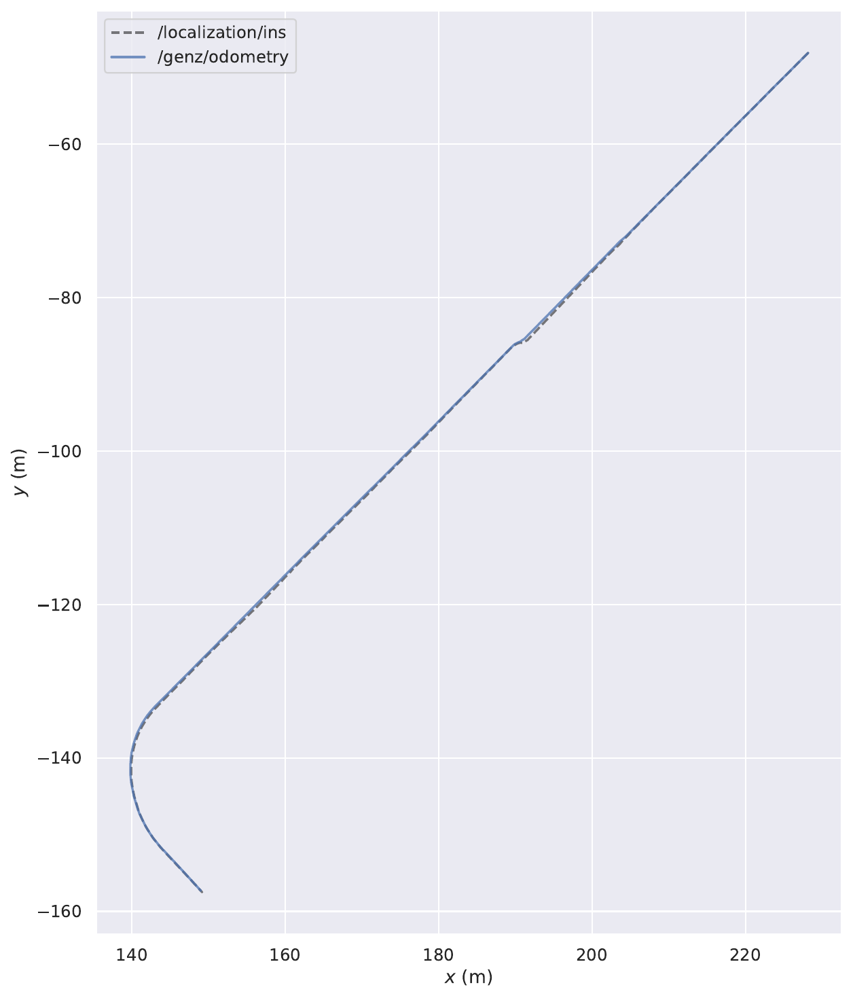
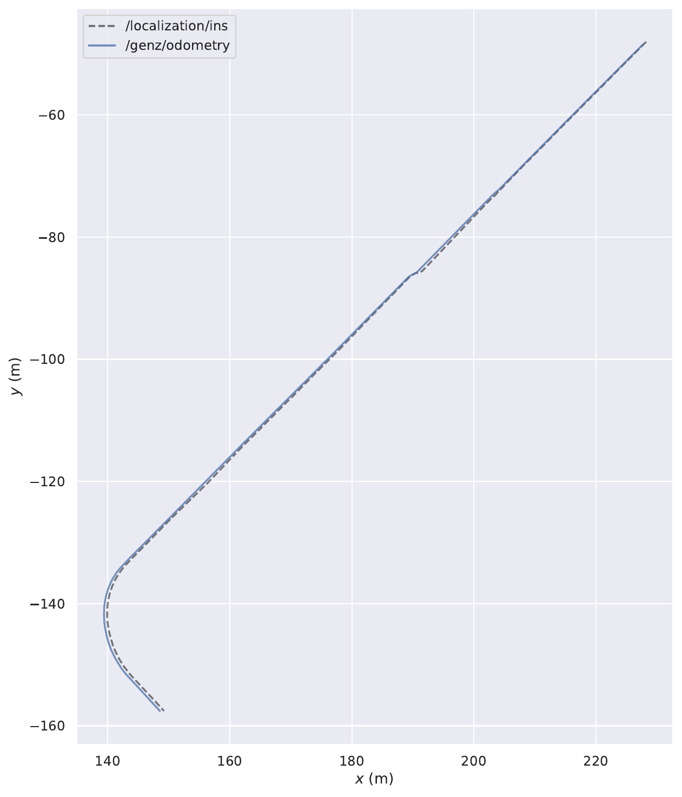

# LocLO 资源占用测试报告

首次测试日期：2026-06-20

隔离复测日期：2026-06-21

测试对象：`loc_lo_node`

测试数据：`/home/guoli/data/yangpu/loc/merged_bag.bag`

面向方案汇报的精简结论、算法边界、改进方向和第二定位源集成设计，见 [LocLO算法分析与集成方案.md](LocLO算法分析与集成方案.md)。

## 1. 测试目的

本次测试用于评估 `Loc_LO.cpp` 在纯 LO 模式下的资源占用情况。隔离复测时关闭 RViz、调试点云、外部全局地图显示、全局地图精匹配、TF 发布和录包；`pidstat` 只绑定 `loc_lo_node` 的 PID，避免把 `rosbag play` 的 CPU 计入节点结果。

## 2. 测试配置

启动配置等价于：

```bash
roslaunch --skip-log-check genz_icp loc_lo.launch \
  visualize:=false \
  publish_global_map:=false \
  refine_ins_init:=false \
  publish_odom_tf:=false \
  record:=false
```

播放命令：

```bash
rosbag play /home/guoli/data/yangpu/loc/merged_bag.bag --clock
```

bag 信息：

| 项目 | 数值 |
| --- | --- |
| 时长 | 368.9 s |
| 文件大小 | 8.4 GB |
| 解压后数据量 | 26.5 GB |
| `/lidar_preprocessor/meta_cloud` | 3689 帧，约 10 Hz |
| `/localization/ins` | 33698 帧，约 91 Hz |

节点参数要点：

| 参数 | 值 |
| --- | --- |
| `odom_frame` | `map` |
| `use_ins_init` | `true` |
| `refine_ins_init` | `false` |
| `visualize` | `false` |
| `publish_global_map` | `false` |
| `publish_odom_tf` | `false` |
| `record` | `false` |
| `config_file` | `outdoor.yaml` |
| `voxel_size` | `0.6` |
| `desired_num_voxelized_points` | `3000` |
| `max_num_iterations` | `100` |

## 3. 采集方法

采集命令：

```bash
pidstat -urd -p <loc_lo_node_pid> 1
rostopic hz /genz/odometry
/usr/bin/time -v rosbag play /home/guoli/data/yangpu/loc/merged_bag.bag --clock
```

原始采样文件：

```text
/tmp/loc_lo_resource_test/pidstat_loc_lo.txt
/tmp/loc_lo_resource_test/rostopic_hz_odometry.txt
/tmp/loc_lo_resource_test/rosbag_play_time.txt
/tmp/loc_lo_resource_test/rosbag_play.log
```

2026-06-21 隔离复测采样文件：

```text
/tmp/loc_lo_resource_retest_20260621/pidstat_loc_lo.txt
/tmp/loc_lo_resource_retest_20260621/mpstat_system.txt
/tmp/loc_lo_resource_retest_20260621/rosparams.yaml
/tmp/loc_lo_resource_retest_20260621/rosbag_play_time.txt
```

隔离复测环境：18 个逻辑 CPU；测试前无其他 ROS 算法节点。运行期间只有 ROS master、`rosout`、`loc_lo_node` 和回放数据所必需的 `rosbag play`。CPU/RSS/IO 数值来自 PID `9808`，仅代表 `loc_lo_node`。整机 CPU 另由 `mpstat` 独立记录，用于排查其他进程干扰。

## 4. 测试结果

### 4.1 输出频率

`/genz/odometry` 输出频率沿用首次测试结果；为满足“只采样算法 PID”的要求，隔离复测没有额外启动 `rostopic hz` 观察节点：

| 指标 | 数值 |
| --- | --- |
| 平均频率 | 9.935 Hz |
| 最小间隔 | 0.011 s |
| 最大间隔 | 0.319 s |
| 标准差 | 0.0485 s |
| 统计窗口 | 3665 帧 |

结论：整体基本跟住了 10 Hz 点云输入。存在最大 319 ms 的输出间隔，说明个别帧处理或调度有抖动，但没有长期掉频。

### 4.2 CPU

2026-06-21 隔离复测全量采样，包括启动和结束的 4 个 0% 样本：

| 指标 | 数值 |
| --- | --- |
| 样本数 | 376 |
| 平均 CPU | 233.45% |
| 用户态平均 | 206.30% |
| 系统态平均 | 27.15% |
| CPU 中位数 | 229.00% |
| CPU P95 | 462.75% |
| CPU P99 | 615.25% |
| 峰值 CPU | 713.00% |

运行中采样，过滤掉 0% 空闲样本：

| 指标 | 数值 |
| --- | --- |
| 样本数 | 372 |
| 平均 CPU | 235.96% |
| 用户态平均 | 208.51% |
| 系统态平均 | 27.44% |
| CPU 中位数 | 233.00% |
| CPU P95 | 463.35% |
| CPU P99 | 615.61% |
| 峰值 CPU | 713.00% |

整机 CPU 状态：

| 指标 | 数值 |
| --- | --- |
| 样本数 | 376 |
| 平均空闲 CPU | 86.04% |
| 最低空闲 CPU | 58.69% |

与 2026-06-20 首次测试对比：

| 指标 | 首次测试 | 隔离复测 |
| --- | ---: | ---: |
| 运行中平均 CPU | 249.71% | 235.96% |
| 峰值 CPU | 780.00% | 713.00% |

两次测试都关闭了 `publish_global_map`；本次还明确关闭了 `refine_ins_init`，节点日志只出现 raw INS 初始化，没有 PCD 加载、NDT 或全局地图精匹配日志。因此 700% 以上峰值与外部地图加载无关。

解释：

- 平均 CPU 约 236%，即平均使用约 2.36 个 CPU core。
- P95 约 463%，多数帧显著低于峰值；713% 是 1 秒采样窗口内的瞬时多核并行。
- 峰值主要来自 TBB 并行对应点搜索、线性系统构建、体素化和滚动局部地图更新。
- 这里的“局部地图”是 LO 算法在线维护的核心体素地图，不是外部 PCD 全局地图，不能关闭。
- 整机平均仍有 86% CPU 空闲，说明复测没有受到其他高负载进程明显干扰。

### 4.3 内存

全量采样：

| 指标 | 数值 |
| --- | --- |
| 平均 RSS | 112901 KB，约 110.3 MB |
| 最小 RSS | 33696 KB，约 32.9 MB |
| 最大 RSS | 137964 KB，约 134.7 MB |
| 最大 VSZ | 2160232 KB，约 2.06 GB |

运行中采样，过滤掉启动初期低 RSS：

| 指标 | 数值 |
| --- | --- |
| 平均 RSS | 113192 KB，约 110.5 MB |
| 最小 RSS | 33696 KB，约 32.9 MB |
| 最大 RSS | 137964 KB，约 134.7 MB |

解释：

- 实际物理内存 RSS 峰值约 135 MB，不高，与首次测试约 137 MB 接近。
- VSZ 峰值约 2.06 GB，但这是虚拟地址空间，不等于真实占用。
- RSS 随滚动局部地图建立而增长，随后保持有界，没有看到外部 PCD 被加载或内存失控增长。

### 4.4 IO

`loc_lo_node` 自身 IO：

| 指标 | 数值 |
| --- | --- |
| 平均读 | 0.74 KB/s |
| 平均写 | 0.00 KB/s |
| 峰值读 | 140.00 KB/s |
| 峰值写 | 0.00 KB/s |

解释：

- 节点本身几乎没有磁盘 IO。
- 大量 IO 来自 `rosbag play` 读取 8.4 GB bag，不属于 `loc_lo_node` 本体开销。

`rosbag play` 进程资源：

| 指标 | 数值 |
| --- | --- |
| 墙钟时间 | 6:13.50 |
| CPU | 8% |
| 最大 RSS | 55500 KB，约 54.2 MB |
| File system inputs | 17227968 blocks |
| File system outputs | 35576 blocks |

## 5. 运行现象

1. 首帧 INS 初始化成功：

```text
LocLO initialized from INS pose xyz=228.174 -48.0891 -0.0468386
```

2. 点云处理过程中 `/genz/odometry` 基本稳定在 10 Hz 附近。

3. 复测日志没有出现外部 PCD 加载、NDT 或 GenZ 全局精匹配，只出现 raw INS 初始化，确认全局地图没有参与测试。

4. ROS 日志目录本次只有约 60 KB，没有出现日志文件爆炸。

## 6. 结论

在关闭 RViz、调试点云、全局地图和录包的纯算法配置下，`loc_lo_node` 可以完整处理 368.9 秒、10 Hz 点云数据。

资源结论：

- CPU：运行中平均约 2.36 核，P95 约 4.63 核，1 秒峰值约 7.13 核。
- 内存：RSS 峰值约 135 MB，整体较轻。
- IO：节点本身几乎无磁盘 IO。
- 实时性：`/genz/odometry` 平均 9.935 Hz，基本跟住输入点云。

总体判断：当前配置下资源占用主要瓶颈是 CPU，不是内存或磁盘。隔离复测证明 700% 以上峰值不是加载外部地图造成的，而是 ICP 对应点搜索、TBB 并行构建线性系统、体素化和局部地图更新产生的短时并行峰值。

## 7. 建议

### 7.1 短期建议

1. 保持关闭底层终端状态条。

当前 `Loc_LO.cpp` 已在构造 `odometry_` 后调用：

```cpp
odometry_.SetTerminalStatusEnabled(false);
```

隔离复测中没有出现 GenZ-ICP 状态条刷屏，应保留该配置。

2. 保持资源测试配置分层。

建议后续继续按下面四组测：

```text
纯算法：rviz=false visualize=false publish_global_map=false record=false
加录包：rviz=false visualize=false publish_global_map=false record=true
加 debug cloud：rviz=false visualize=true publish_global_map=false record=false
全可视化：rviz=true visualize=true publish_global_map=true record=false
```

3. 录包评估时仍建议只录：

```text
/genz/odometry
/localization/ins
```

不要录点云、local_map、global_map。

### 7.2 算法资源优化方向

如果后续 CPU 需要下降，可以优先尝试：

- 降低 `desired_num_voxelized_points`，例如从 3000 测到 2000、1500。
- 增大 `voxel_size`，例如从 0.6 测到 0.8。
- 降低 `max_num_iterations`，例如从 100 测到 60。
- 降低调试点云发布频率，尤其是 `/genz/local_map`。
- 给 `Registration::RegisterFrame()` 增加每帧耗时和对应点数量统计，定位 CPU 峰值对应的场景。

### 7.3 补充 evo 精度评估：仅使用 INS 初值

补充测试日期：2026-06-20  
评估 bag：

```text
/home/guoli/data/yangpu/loc/loc_lo_raw_ins_eval.bag
```

本次补充测试关闭精匹配初始化，只用首帧 `/localization/ins` 直接初始化 LO：

```bash
roslaunch --skip-log-check genz_icp loc_lo.launch \
  rviz:=false \
  visualize:=false \
  publish_global_map:=false \
  record:=true \
  record_bag:=/home/guoli/data/yangpu/loc/loc_lo_raw_ins_eval.bag \
  refine_ins_init:=false
```

节点日志确认没有使用精匹配：

```text
LocLO initialized from INS pose xyz=   228.174   -48.0891 -0.0478386
```

评估 bag 内容：

| 话题 | 数量 |
| --- | --- |
| `/genz/odometry` | 3668 |
| `/localization/ins` | 33698 |

评估 bag 大小：27.5 MB。

#### APE 三维平移误差

```bash
evo_ape bag /home/guoli/data/yangpu/loc/loc_lo_raw_ins_eval.bag \
  /localization/ins /genz/odometry \
  --pose_relation trans_part \
  --save_results /home/guoli/data/yangpu/loc/loc_lo_raw_ins_ape.zip
```

| 指标 | 数值 |
| --- | --- |
| RMSE | 0.440420 m |
| mean | 0.413062 m |
| median | 0.511828 m |
| std | 0.152805 m |
| min | 0.001000 m |
| max | 0.708681 m |

#### APE XY 平面误差

```bash
evo_ape bag /home/guoli/data/yangpu/loc/loc_lo_raw_ins_eval.bag \
  /localization/ins /genz/odometry \
  --pose_relation trans_part \
  --project_to_plane xy
```

| 指标 | 数值 |
| --- | --- |
| RMSE | 0.285017 m |
| mean | 0.268217 m |
| median | 0.261083 m |
| std | 0.096407 m |
| min | 0.000000 m |
| max | 0.672690 m |

#### RPE 1m 相对平移误差

```bash
evo_rpe bag /home/guoli/data/yangpu/loc/loc_lo_raw_ins_eval.bag \
  /localization/ins /genz/odometry \
  --pose_relation trans_part \
  --delta 1 \
  --delta_unit m \
  --save_results /home/guoli/data/yangpu/loc/loc_lo_raw_ins_rpe_1m.zip
```

| 指标 | 数值 |
| --- | --- |
| RMSE | 0.056767 m |
| mean | 0.042440 m |
| median | 0.031071 m |
| std | 0.037701 m |
| min | 0.003797 m |
| max | 0.251822 m |

#### 误差分解

用最近时间戳匹配 `/genz/odometry` 与 `/localization/ins`，最大同步差限制为 0.05 s。

| 指标 | 数值 |
| --- | --- |
| 匹配对数 | 3668 |
| XY RMSE | 0.285364 m |
| Z signed mean | -0.261800 m |
| Z RMSE | 0.336346 m |
| XYZ RMSE | 0.441091 m |
| 平均同步时间差 | 0.003293 s |
| 最大同步时间差 | 0.022897 s |

轨迹图：

```text
/home/guoli/data/yangpu/loc/loc_lo_raw_ins_traj_xy.pdf
```

仅使用 INS 初值的 XY 轨迹如下。灰色虚线为 `/localization/ins`，蓝色实线为 `/genz/odometry`：



#### 与精匹配裁剪地图版本对比

对比版本见：

```text
docs/LocLO精匹配裁剪地图测试报告.md
```

| 指标 | 仅 INS 初值 | INS + GenZ 精匹配初始化 |
| --- | ---: | ---: |
| 初始化方式 | raw INS | INS 先验 + 裁剪地图 GenZ 精匹配 |
| 初始化地图点数 | 0 | 346867 |
| APE 3D RMSE | 0.440420 m | 1.869668 m |
| APE XY RMSE | 0.285017 m | 0.541970 m |
| RPE 1m RMSE | 0.056767 m | 0.061271 m |
| Z signed mean | -0.261800 m | +1.782998 m |
| `/genz/odometry` 路径长度 | 159.175 m | 159.379 m |
| `/localization/ins` 路径长度 | 152.089 m | 152.089 m |
| 评估 bag 大小 | 27.5 MB | 27.5 MB |

#### 两种初始化方式的轨迹直观对比

仅使用 INS 初值：


INS + GenZ 精匹配初始化：



从图中可以看到，两组轨迹在大部分直线路段都与 INS 基本重合。精匹配初始化版本在左下弯道以及部分直线路段的横向偏差更明显，这与其较大的 XY APE RMSE 一致。

结论：

- 在 `merged_bag.bag` 这段数据上，仅使用 INS 首帧直接初始化的 evo 结果更好。
- 精匹配初始化虽然首帧匹配分数很高，但输出 pose 的 Z 方向出现约 +1.78 m 系统偏差，导致 3D APE 明显变差，XY APE 也比 raw INS 初值更大。
- RPE 1m 两者接近，说明后续 LO 相对运动都比较稳定，主要差异来自初始化全局 pose，尤其是高度/坐标基准。
- 因此精匹配初始化不能只看 correspondence ratio 分数；还需要增加高度约束、INS 到匹配结果的位姿差门限、或只采用精匹配的 yaw/xy 修正而保留 INS 的 z。
- 精匹配版本逐帧误差时刻、最大误差位置和坐标系原因分析见 `docs/LocLO精匹配裁剪地图测试报告.md` 第 6 节。
