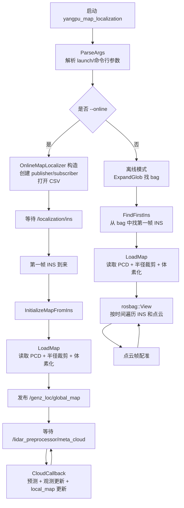
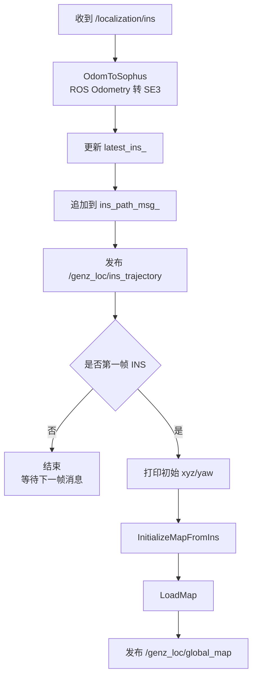
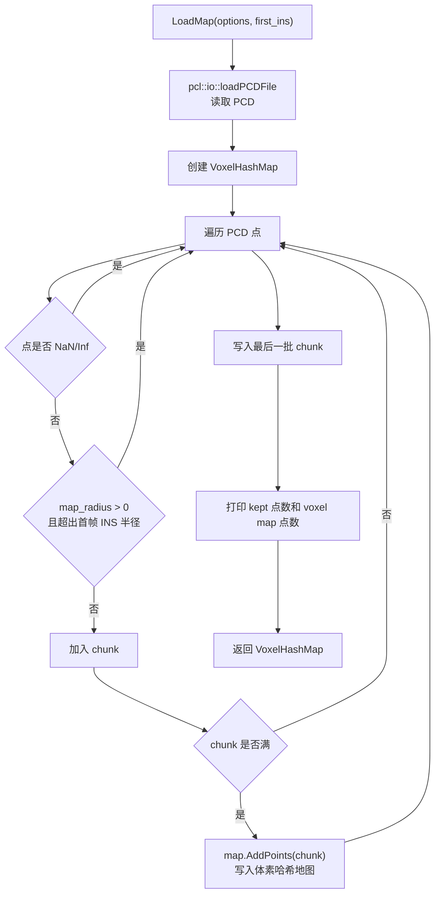
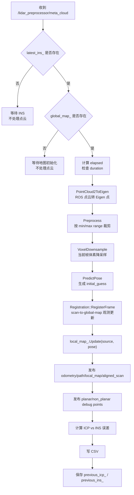
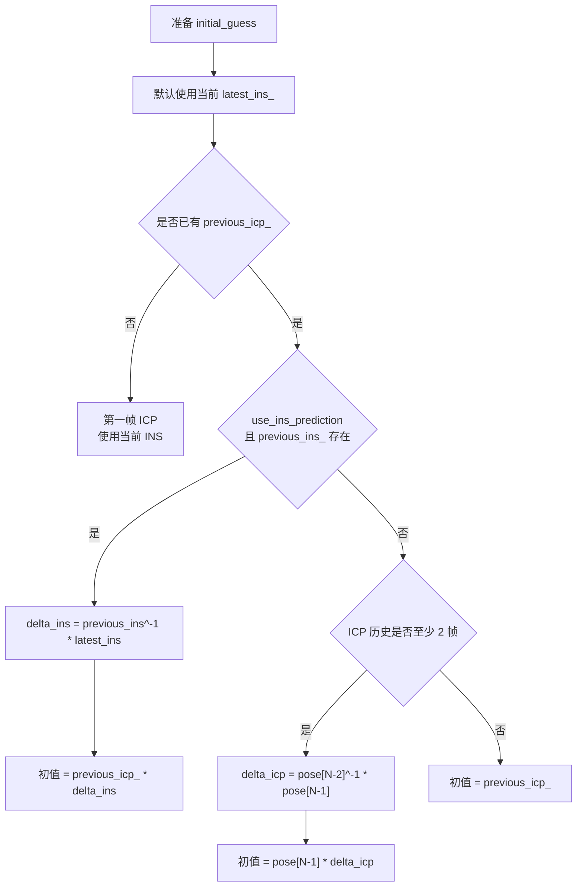
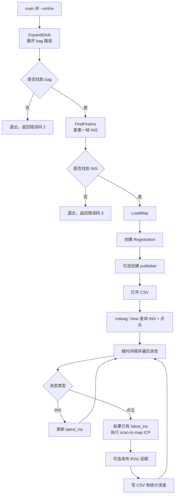

# Loc_Map.cpp 流程说明

这份文档专门说明 `ros/tools/Loc_Map.cpp` 的流程。它是为杨浦数据集写的地图定位验证工具，核心目标是：把实时 LiDAR 点云配准到已有 PCD 地图上，输出车辆在 `map` 坐标系下的定位结果，并用 `/localization/ins` 做初始化、轨迹对比和误差评估。

对应文件：

- `ros/tools/Loc_Map.cpp`
- `ros/launch/yangpu_map_localization.launch`
- `ros/rviz/yangpu_map_localization.rviz`

## 1. 一句话理解

`Loc_Map.cpp` 做的是 scan-to-global-map localization：

```text
输入：
  1. 全局 PCD 地图
  2. /localization/ins
  3. /lidar_preprocessor/meta_cloud

处理：
  点云预处理 -> 预测位姿 -> scan-to-global-map 观测更新 -> 更新 rolling local_map

输出：
  /genz_loc/odometry
  /genz_loc/trajectory
  /genz_loc/ins_trajectory
  /genz_loc/global_map
  /genz_loc/local_map
  /genz_loc/aligned_scan
  /genz_loc/planar_points
  /genz_loc/non_planar_points
  CSV 误差文件
```

它和原始 `OdometryServer.cpp` 的主要区别是：`OdometryServer.cpp` 是连续点云里程计，局部地图同时作为匹配地图；`Loc_Map.cpp` 是拿外部 PCD 当固定全局地图做定位，每帧点云都对齐到这张地图，同时额外维护一张 rolling `local_map` 用于 RViz 观察局部建图和轨迹连续性。

## 2. 总体流程图



当前推荐使用在线模式，也就是通过 `yangpu_map_localization.launch` 启动节点和 RViz，然后你自己在另一个终端手动 `rosbag play`。

## 3. 在线模式流程

在线模式由 `--online` 触发，launch 文件默认就是这个模式。

### 3.1 启动阶段

启动命令通常是：

```bash
source /opt/ros/noetic/setup.bash
source /home/guoli/proj/genz-icp_ws/devel/setup.bash
roslaunch genz_icp yangpu_map_localization.launch
```

launch 会启动：

- `yangpu_map_localization` 节点
- RViz
- 可选 rosbag record，用于录制评估 bag

注意：launch 不会自动播放 bag。bag 需要你手动播放：

```bash
cd /home/guoli/data/yangpu/A203/A203
rosbag play 2026-06-03-1*.bag
```

如果只想快速测试 100 秒：

```bash
cd /home/guoli/data/yangpu/A203/A203
rosbag play -u 100 2026-06-03-1*.bag
```

### 3.2 构造 `OnlineMapLocalizer`

`OnlineMapLocalizer` 构造函数做这些事：

1. 创建 `Registration` 配准器。
2. 打开 CSV 文件。
3. 创建输出话题 publisher。
4. 订阅 INS 和点云话题。
5. 等待第一帧 INS。

创建的话题包括：

| 话题 | 类型 | 作用 |
| --- | --- | --- |
| `/genz_loc/global_map` | `sensor_msgs/PointCloud2` | 发布裁剪/体素化后的地图 |
| `/genz_loc/local_map` | `sensor_msgs/PointCloud2` | 发布 rolling 局部地图，保存当前轨迹附近已配准 scan 点 |
| `/genz_loc/aligned_scan` | `sensor_msgs/PointCloud2` | 发布配准到地图坐标系后的当前帧点云 |
| `/genz_loc/planar_points` | `sensor_msgs/PointCloud2` | 发布参与点到面约束的平面点 |
| `/genz_loc/non_planar_points` | `sensor_msgs/PointCloud2` | 发布参与点到点约束的非平面点 |
| `/genz_loc/odometry` | `nav_msgs/Odometry` | 发布 GenZ-ICP 地图定位结果 |
| `/genz_loc/trajectory` | `nav_msgs/Path` | 发布 GenZ-ICP 累计轨迹 |
| `/genz_loc/ins_trajectory` | `nav_msgs/Path` | 发布 INS 参考轨迹 |

## 4. INS 回调流程

INS 回调函数是 `InsCallback()`。



第一帧 INS 非常关键，因为它有两个作用：

1. 作为地图裁剪中心。
2. 作为第一帧 ICP 的初始位姿。

如果第一帧 INS 和地图不是同一个坐标系，后续 ICP 初值会不准，地图裁剪也可能裁错区域。

## 5. 地图加载流程

地图加载函数是 `LoadMap()`。



关键参数：

| 参数 | 含义 | 影响 |
| --- | --- | --- |
| `map_path` | PCD 地图路径 | 决定使用哪张地图 |
| `map_radius` | 以首帧 INS 为圆心裁剪地图的半径 | 太小会开出地图范围，太大内存和计算量增加 |
| `map_voxel_size` | 地图体素大小 | 越小地图越密，越慢；越大地图越稀，细节减少 |
| `max_points_per_voxel` | 每个体素最多保留点数 | 控制地图密度 |
| `planarity_threshold` | 平面判断阈值 | 影响平面点/非平面点分类 |

注意：`pcl::io::loadPCDFile` 会先把整张 PCD 读入内存，然后代码才按 `map_radius` 裁剪。所以特别大的 PCD 最好提前离线降采样或裁剪。

## 6. 点云回调流程

点云回调函数是 `CloudCallback()`，这是在线定位的核心。



### 6.1 预测策略

预测函数是 `PredictPose()`，它给 scan-to-map ICP 提供 `initial_guess`：



`initial_guess` 的第一帧永远由 INS 提供。后续预测由 launch 参数 `use_ins_prediction` 控制。

当 `use_ins_prediction:=true` 时：

- 第一帧使用 INS。
- 后续以上一帧 ICP 为基准。
- 如果有上一帧 INS，则计算 `delta_ins = previous_ins^-1 * latest_ins`。
- 当前预测位姿为 `previous_icp * delta_ins`。

当 `use_ins_prediction:=false` 时：

- 第一帧仍然使用 INS。
- 后续不再使用 INS 帧间增量。
- 预测方式改为和 `OdometryServer.cpp` / `GenZICP::GetPredictionModel()` 一样的 ICP 恒速模型：

```cpp
delta_icp = pose_history[N - 2].inverse() * pose_history[N - 1];
initial_guess = pose_history[N - 1] * delta_icp;
```

launch 中可以这样关闭 INS prediction：

```bash
roslaunch genz_icp yangpu_map_localization.launch use_ins_prediction:=false
```

### 6.2 配准调用

核心调用是：

```cpp
registration_.RegisterFrame(source,
                            *global_map_,
                            initial_guess,
                            options_.max_correspondence_distance,
                            options_.kernel);
```

输入含义：

- `source`：当前帧点云，经过距离裁剪和体素降采样。
- `global_map_`：从 PCD 构建的 `VoxelHashMap`。
- `initial_guess`：当前帧车体在 `map` 下的初始位姿。
- `max_correspondence_distance`：最大对应点距离。
- `kernel`：鲁棒核参数。

输出含义：

- `pose`：优化后的当前帧位姿。
- `planar_points`：被判定为平面约束的 source 点。
- `non_planar_points`：被判定为非平面约束的 source 点。

`planar_points` 和 `non_planar_points` 不是原始整帧点云，而是成功找到地图对应关系并参与优化的调试点。它们可以用来判断这一帧 ICP 有没有足够的几何约束。

### 6.3 local_map 更新

`Loc_Map.cpp` 的匹配目标始终是固定的 `global_map_`，也就是从 PCD 构建的地图。`local_map_` 不参与全局定位匹配，它的作用是调试和可视化。

观测更新完成后会执行：

```cpp
local_map_.Update(source, pose);
```

这一步会：

1. 用最终 `pose` 把当前帧 `source` 从车体坐标系变换到 `map` 坐标系。
2. 把变换后的点写入 rolling `VoxelHashMap`。
3. 按 `local_map_radius` 清理离当前位姿太远的点。
4. 发布 `/genz_loc/local_map`。

这样 RViz 里可以同时看：

- `global_map`：固定 PCD 地图。
- `aligned_scan`：当前帧匹配结果。
- `local_map`：沿轨迹滚动累积的局部点云。
- `trajectory` 和 `ins_trajectory`：ICP 与 INS 两条轨迹。

## 7. 发布与记录

单帧 ICP 完成后会发布：

| 输出 | 说明 |
| --- | --- |
| `/genz_loc/odometry` | 当前帧 ICP 位姿，evo 评估主要看它 |
| `/genz_loc/trajectory` | ICP 累计轨迹，RViz 中红色 |
| `/genz_loc/ins_trajectory` | INS 累计轨迹，RViz 中亮青色 |
| `/genz_loc/local_map` | rolling 局部地图，RViz 中黄色 |
| `/genz_loc/aligned_scan` | 用 ICP pose 变换到 map 下的当前帧点云 |
| `/genz_loc/planar_points` | 平面约束点，RViz 中绿色 |
| `/genz_loc/non_planar_points` | 非平面约束点，RViz 中橙色 |

CSV 每帧写一行：

| 字段 | 含义 |
| --- | --- |
| `stamp` | 当前点云时间戳 |
| `elapsed` | 相对第一帧点云经过的时间 |
| `frame` | 点云帧号 |
| `scan_points` | 原始点云转换后的点数 |
| `source_points` | 裁剪和降采样后的点数 |
| `icp_x/icp_y/icp_z/icp_yaw` | ICP 输出位姿 |
| `ins_x/ins_y/ins_z/ins_yaw` | 当前缓存的 INS 位姿 |
| `error_xy` | ICP 和 INS 的 XY 平面误差 |
| `error_z` | ICP 和 INS 的 Z 误差 |
| `error_yaw_rad` | ICP 和 INS 的 yaw 误差 |

## 8. 离线模式流程

如果不传 `--online`，程序会进入离线模式。离线模式不需要 `rosbag play`，它自己打开 bag 文件。



离线模式适合快速复现实验、批量跑参数、只生成 CSV。但你现在主要使用的是在线模式，因为它更方便和 RViz、手动播放 bag 配合。

## 9. 和 OdometryServer.cpp 的关系

| 对比项 | Loc_Map.cpp | OdometryServer.cpp |
| --- | --- | --- |
| 任务 | 全局地图定位 | LiDAR 里程计 |
| 地图 | 外部 PCD 固定地图 | 在线维护局部地图 |
| 初值 | 第一帧 INS，后续 INS prediction 或 ICP 恒速模型 | 内部运动模型 |
| local_map | 维护 rolling local_map，但不作为匹配目标 | 维护 local_map，并作为 odometry 匹配目标 |
| 输出坐标系 | `map` | 通常是 `odom` |
| 是否会累计漂移 | 如果地图有效，理论上不应长期累计漂移 | 会随着里程计运行累计漂移 |
| 主要评估方式 | 和 `/localization/ins` 用 evo/CSV 对比 | 看相对轨迹和局部一致性 |
| 调试点云 | `/genz_loc/planar_points`、`/genz_loc/non_planar_points` | `/genz/planar_points`、`/genz/non_planar_points` |

简单说：`OdometryServer.cpp` 是原项目的通用里程计入口；`Loc_Map.cpp` 是为杨浦数据集和全局 PCD 地图验证定制的工具。

## 10. 常见问题与排查

### 10.1 RViz 一开始看不到地图

正常。在线模式下地图要等第一帧 `/localization/ins` 到来后才加载，因为代码要用第一帧 INS 决定地图裁剪中心。

检查：

```bash
rostopic echo -n 1 /localization/ins
rostopic echo -n 1 /genz_loc/global_map
```

### 10.2 地图像一个圆圈，车辆开出去后漂移

这是 `map_radius` 裁剪造成的。只加载了首帧 INS 周围一圈地图，车开出这个区域后就没有地图点可匹配。

处理方式：

- 增大 `map_radius`
- 或设置 `map_radius:=0.0` 使用完整地图
- 或提前制作覆盖完整路线的降采样 PCD

示例：

```bash
roslaunch genz_icp yangpu_map_localization.launch map_radius:=0.0
```

### 10.3 两条轨迹整体有固定偏移

先确认 `/localization/ins` 和 PCD 地图是否真在同一个 `map` 坐标系。如果不是，CSV 和 RViz 中的误差会整体偏大，evo 评估也需要先做坐标对齐。

### 10.4 平面点/非平面点很少

可能原因：

- `max_corr` 太小，对应点找不到。
- `scan_voxel` 太大，当前帧点太稀。
- 地图和当前点云不重叠。
- 初值偏差太大。
- 地图局部几何退化，例如道路开阔区域约束少。

建议先看 RViz：

- 蓝色 aligned scan 是否贴近地图。
- 绿色 planar points 是否分布在墙面、地面边界等稳定结构附近。
- 橙色 non-planar points 是否覆盖杆、边缘、树干、路沿等结构。

### 10.5 evo 评估建议

录包时不要录点云，文件会很大。launch 默认只录：

- `/genz_loc/odometry`
- `/localization/ins`

常用 XY APE：

```bash
evo_ape bag /home/guoli/data/yangpu/loc/yangpu_loc_genz_icp_eval2.bag \
  /localization/ins /genz_loc/odometry \
  -r trans_part --project_to_plane xy --t_max_diff 0.05 --plot
```

轨迹对比：

```bash
evo_traj bag /home/guoli/data/yangpu/loc/yangpu_loc_genz_icp_eval2.bag \
  /localization/ins /genz_loc/odometry \
  --ref /localization/ins --plot
```

## 11. 推荐阅读顺序

如果你要快速掌握这份代码，建议按下面顺序看：

1. `Options`：先理解所有参数。
2. `main()`：看在线/离线模式怎么分流。
3. `OnlineMapLocalizer` 构造函数：看发布/订阅了哪些话题。
4. `InsCallback()`：看第一帧 INS 如何触发地图加载。
5. `LoadMap()`：看 PCD 如何变成 `VoxelHashMap`。
6. `CloudCallback()`：看单帧点云如何完成 scan-to-map。
7. `Registration::RegisterFrame()`：再进入底层 ICP 优化细节。

先掌握前 6 步，就已经足够调 Yangpu 数据集的大部分问题。
