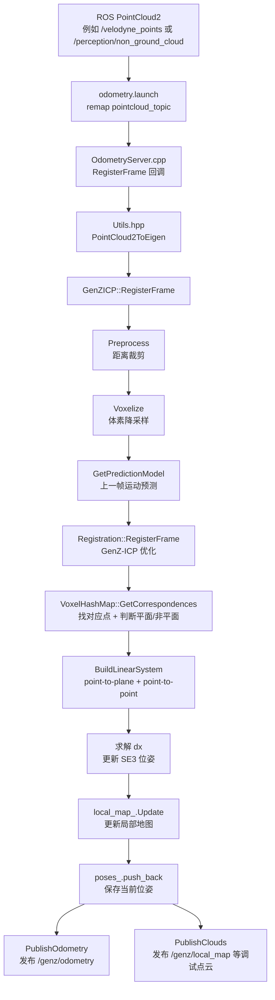
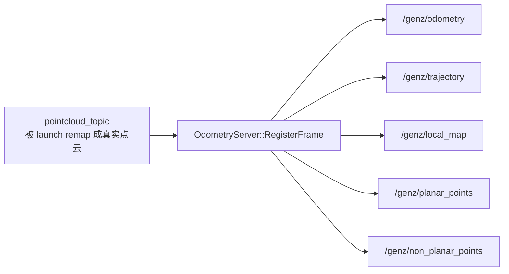
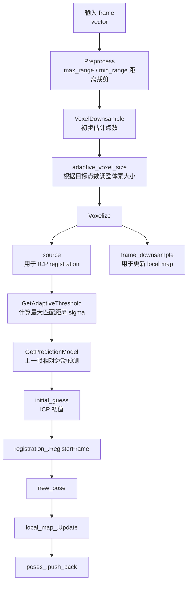
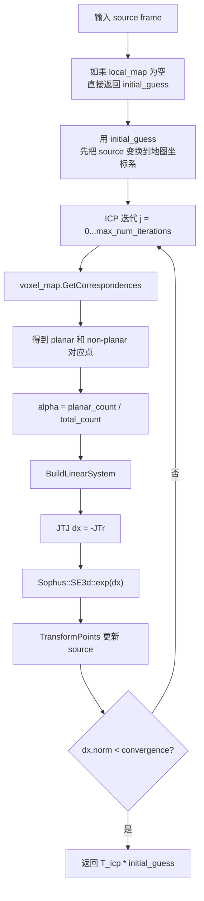
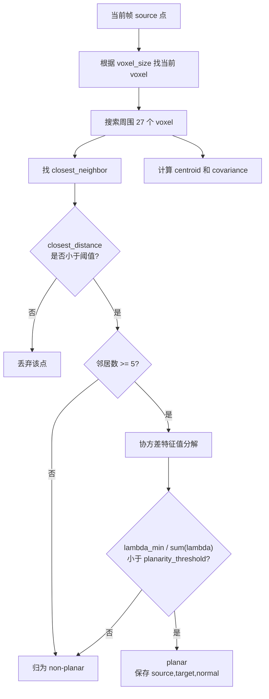
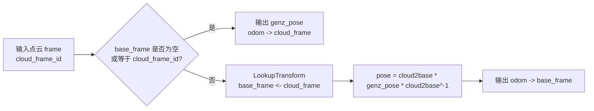
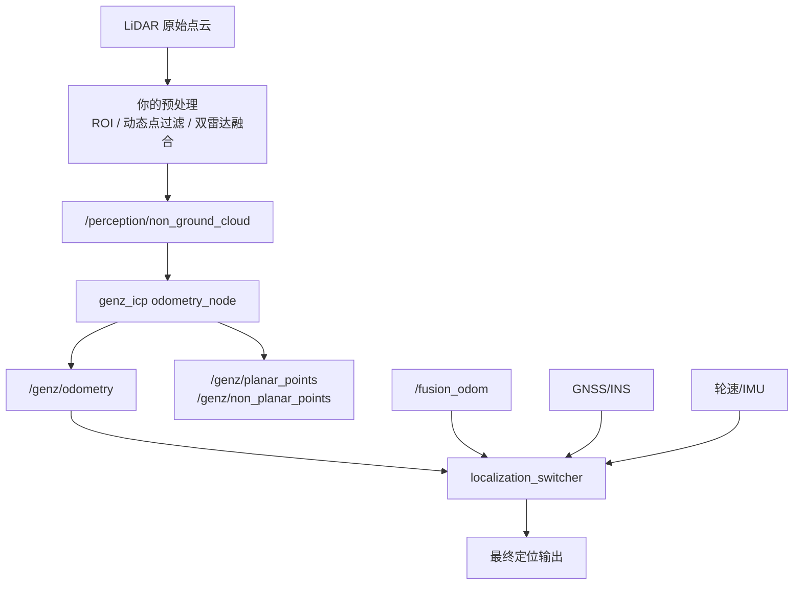
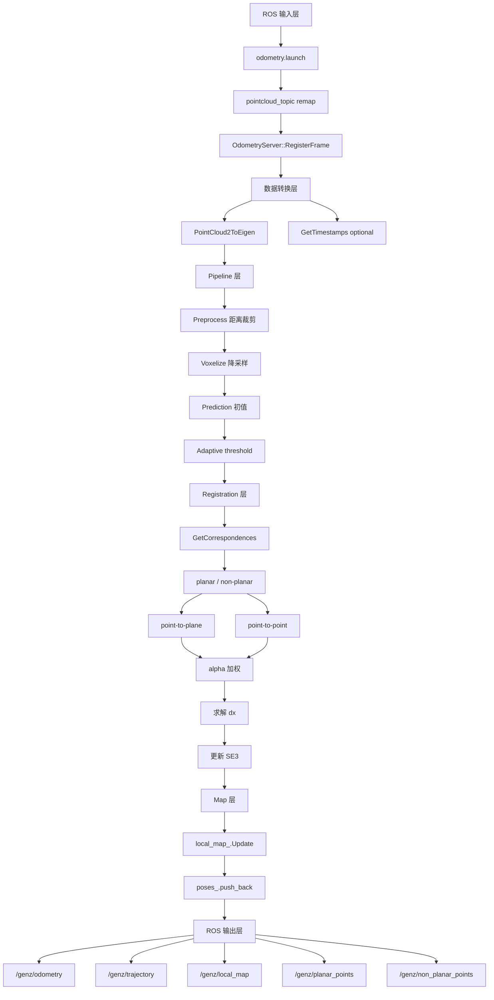

下面我按**ROS 数据流方向**带你读这个项目。你先不要陷入每一行公式，先建立一张“点云从哪里来、经过哪些模块、最后怎么变成 `/genz/odometry`”的图。

---

# 0. 一句话理解这个 ROS 项目

GenZ-ICP 在 ROS 里就是一个节点：

```text
输入：sensor_msgs/PointCloud2 点云
输出：nav_msgs/Odometry 里程计
附加输出：轨迹、局部地图、平面点、非平面点
```

也就是：

```text
PointCloud2
   ↓
GenZ-ICP scan-to-local-map ICP
   ↓
/genz/odometry
```

它不是完整全局 SLAM，不做 GPS 因子、不做回环、不做全局地图优化。它主要负责**激光里程计前端**。

---

# 1. 总体数据流图

你可以先记住这张主图：



你后面读源码，就按照这个图从上往下读。

---

# 2. 第一层：`odometry.launch`，ROS 参数和话题入口

先看：

```text
ros/launch/odometry.launch
```

这个文件决定节点怎么启动、点云 topic 怎么 remap、参数怎么加载。

关键部分是：

```xml
<node pkg="genz_icp" type="odometry_node" name="odometry_node" output="screen">
  <remap from="pointcloud_topic" to="$(arg topic)"/>
  <param name="odom_frame" value="$(arg odom_frame)"/>
  <param name="base_frame" value="$(arg base_frame)"/>
  <param name="publish_odom_tf" value="$(arg publish_odom_tf)"/>
  <param name="visualize" value="$(arg visualize)"/>
</node>
```

源码里确实是通过 `topic` 参数把你的真实点云话题 remap 到节点内部的 `pointcloud_topic`。同时它设置 `odom_frame`、`base_frame`、`publish_odom_tf`、`visualize` 等 ROS 参数。

所以你运行时应该这样理解：

```bash
roslaunch genz_icp odometry.launch \
  topic:=/你的点云话题 \
  odom_frame:=odom \
  base_frame:=base_link
```

比如你的项目里可以先这样跑：

```bash
roslaunch genz_icp odometry.launch \
  topic:=/perception/non_ground_cloud \
  odom_frame:=odom \
  base_frame:=base_link \
  publish_odom_tf:=false \
  visualize:=true \
  config_file:=outdoor.yaml
```

我建议你一开始：

```bash
publish_odom_tf:=false
```

因为你系统里可能已经有自己的 `/odom -> /base_link` 或 `/map -> /base_link`，不要让 GenZ-ICP 一上来抢 TF。

---

# 3. 第二层：`OdometryServer.cpp`，ROS 节点主入口

核心文件：

```text
ros/ros1/OdometryServer.cpp
```

它的作用不是算法，而是：

```text
1. 读取 ROS 参数
2. 创建 GenZICP 对象
3. 订阅点云
4. 发布 odometry / trajectory / debug clouds
5. 做 TF frame 转换
```

构造函数里先读参数：

```cpp
pnh_.param("base_frame", base_frame_, base_frame_);
pnh_.param("odom_frame", odom_frame_, odom_frame_);
pnh_.param("publish_odom_tf", publish_odom_tf_, false);
pnh_.param("visualize", publish_debug_clouds_, publish_debug_clouds_);
...
```

然后创建算法对象：

```cpp
odometry_ = genz_icp::pipeline::GenZICP(config_);
```

接着订阅点云：

```cpp
pointcloud_sub_ = nh_.subscribe<sensor_msgs::PointCloud2>(
    "pointcloud_topic", queue_size_,
    &OdometryServer::RegisterFrame, this);
```

发布结果：

```cpp
/genz/odometry
/genz/trajectory
/genz/local_map
/genz/planar_points
/genz/non_planar_points
```

源码中这些订阅和发布都在构造函数里完成。

所以 ROS 层的数据流是：



---

# 4. 第三层：点云回调 `RegisterFrame()`

这是 ROS 点云进入算法的第一站。

代码逻辑：

```cpp
void OdometryServer::RegisterFrame(const sensor_msgs::PointCloud2::ConstPtr &msg) {
    const auto cloud_frame_id = msg->header.frame_id;
    const auto points = PointCloud2ToEigen(msg);

    const auto timestamps = [&]() -> std::vector<double> {
        if (!config_.deskew) return {};
        return GetTimestamps(msg);
    }();

    const auto &[planar_points, non_planar_points] =
        odometry_.RegisterFrame(points, timestamps);

    const Sophus::SE3d genz_pose = odometry_.poses().back();

    ...
    PublishOdometry(pose, msg->header.stamp, cloud_frame_id);
    PublishClouds(...);
}
```

源码里就是先取 `cloud_frame_id`，再把 `PointCloud2` 转成 `std::vector<Eigen::Vector3d>`，然后调用 `odometry_.RegisterFrame(points, timestamps)`。

这里你要抓住一个关键：

```text
ROS 点云消息
    ↓
PointCloud2ToEigen()
    ↓
std::vector<Eigen::Vector3d>
    ↓
GenZICP::RegisterFrame()
```

也就是说，算法层不直接处理 ROS 点云，它只处理 Eigen 点。

---

# 5. `Utils.hpp`：ROS 点云和 Eigen 点之间的转换

核心文件：

```text
ros/ros1/Utils.hpp
```

里面最重要的是：

```cpp
PointCloud2ToEigen()
EigenToPointCloud2()
GetTimestamps()
sophusToPose()
sophusToTransform()
transformToSophus()
```

`PointCloud2ToEigen()` 的作用很直接：从 `PointCloud2` 里读 `x/y/z` 字段，然后塞进 `std::vector<Eigen::Vector3d>`。源码里通过 `sensor_msgs::PointCloud2ConstIterator<float>` 分别遍历 `x`、`y`、`z`。

如果开启 `deskew`，它会尝试从点云字段中读取时间戳字段，只支持：

```text
t
timestamp
time
```

源码中 `GetTimestampField()` 就是找这三个字段，没有就抛异常。

所以你现在工程里如果点云没有逐点时间戳，建议：

```yaml
deskew: false
```

这也是官方 `outdoor.yaml` 默认设置。

---

# 6. 第四层：`GenZICP.cpp`，算法主流程

核心文件：

```text
cpp/genz_icp/pipeline/GenZICP.cpp
```

这是项目最重要的“流程控制层”。

`GenZICP::RegisterFrame()` 的主流程是：

```cpp
const auto &cropped_frame = Preprocess(frame, config_.max_range, config_.min_range);

static double voxel_size = config_.voxel_size;
const auto source_tmp = genz_icp::VoxelDownsample(cropped_frame, voxel_size);
double adaptive_voxel_size = Clamp(...);

const auto &[source, frame_downsample] = Voxelize(cropped_frame, adaptive_voxel_size);

const double sigma = GetAdaptiveThreshold();

const auto prediction = GetPredictionModel();
const auto last_pose = !poses_.empty() ? poses_.back() : Sophus::SE3d();
const auto initial_guess = last_pose * prediction;

const auto &[new_pose, planar_points, non_planar_points] =
    registration_.RegisterFrame(source, local_map_, initial_guess, 3.0 * sigma, sigma / 3.0);

adaptive_threshold_.UpdateModelDeviation(model_deviation);
local_map_.Update(frame_downsample, new_pose);
poses_.push_back(new_pose);
```

源码里这一段完整地串起了预处理、体素降采样、预测、ICP、局部地图更新和位姿保存。

这层你可以画成：



这里有两个点你一定要注意。

---

## 6.1 `source` 和 `frame_downsample` 不一样

源码中：

```cpp
const auto frame_downsample =
    VoxelDownsample(frame, std::max(adaptive_voxel_size * 0.5, 0.02));

const auto source =
    VoxelDownsample(frame_downsample, adaptive_voxel_size * 1.0);
```

`source` 用于 ICP 配准，点更少；`frame_downsample` 用于更新局部地图，保留更多点。

所以：

```text
source：参与当前帧匹配，要求快
frame_downsample：加入局部地图，要求信息稍微多一点
```

---

## 6.2 初值来自上一帧运动模型

源码中：

```cpp
const auto prediction = GetPredictionModel();
const auto last_pose = !poses_.empty() ? poses_.back() : Sophus::SE3d();
const auto initial_guess = last_pose * prediction;
```

`GetPredictionModel()` 用的是：

```cpp
poses_[N - 2].inverse() * poses_[N - 1]
```

也就是“上一帧相对上一上一帧的运动”，作为当前帧运动预测。 

这就是常见的 constant velocity prediction：

```text
上一帧怎么动
这一帧先假设也这么动
然后 ICP 再微调
```

---

# 7. 第五层：预处理和体素降采样

核心文件：

```text
cpp/genz_icp/core/Preprocessing.cpp
```

## 7.1 距离裁剪

`Preprocess()` 只做距离过滤：

```cpp
const double norm = pt.norm();
return norm < max_range && norm > min_range;
```

源码里没有地面分割、动态点剔除、ROI 过滤，只保留距离在 `min_range` 和 `max_range` 之间的点。

所以你工程里最好不要直接喂动态很多的原始点云，而是先喂：

```text
/perception/non_ground_cloud
```

或者你自己过滤后的静态点云。

## 7.2 体素降采样

`VoxelDownsample()` 的逻辑是：

```cpp
const auto voxel = Voxel((point / voxel_size).cast<int>());
if (grid.contains(voxel)) continue;
grid.insert({voxel, point});
```

也就是每个 voxel 只保留一个点。

直观理解：

```text
原始点云很多点
    ↓
划分成一个个小方格 voxel
    ↓
每个小方格只保留一个代表点
    ↓
减少 ICP 计算量
```

---

# 8. 第六层：`Registration.cpp`，ICP 优化核心

核心文件：

```text
cpp/genz_icp/core/Registration.cpp
```

它的入口是：

```cpp
Registration::RegisterFrame(
    const std::vector<Eigen::Vector3d> &frame,
    const VoxelHashMap &voxel_map,
    const Sophus::SE3d &initial_guess,
    double max_correspondence_distance,
    double kernel)
```

这个函数内部流程是：



源码中如果 `voxel_map.Empty()`，直接返回 `initial_guess`；否则先用 `initial_guess` 变换当前帧点，然后进入 ICP 循环，循环中找对应点、计算 `alpha`、构建线性系统、求解 `dx`、用 `Sophus::SE3d::exp(dx)` 更新位姿。

---

# 9. GenZ-ICP 的核心：平面点和非平面点分别处理

`Registration.cpp` 里最核心的是 `BuildLinearSystem()`。

它把点分成两类：

```text
planar 点：point-to-plane 残差
non-planar 点：point-to-point 残差
```

## 9.1 平面点：point-to-plane

源码：

```cpp
double r_planar = (src_planar[i] - tgt_planar[i]).dot(normals[i]);

J_planar.block<1, 3>(0, 0) = normals[i].transpose();
J_planar.block<1, 3>(0, 3) =
    (src_planar[i].cross(normals[i])).transpose();
```

也就是：

[
r = n^T(p_{src} - p_{tgt})
]

它只优化点到局部平面的法向距离。源码对应 `compute_jacobian_and_residual_planar`。

## 9.2 非平面点：point-to-point

源码：

```cpp
const Eigen::Vector3d r_non_planar = src_non_planar[i] - tgt_non_planar[i];

J_non_planar.block<3, 3>(0, 0) = Eigen::Matrix3d::Identity();
J_non_planar.block<3, 3>(0, 3) =
    -1.0 * Sophus::SO3d::hat(src_non_planar[i]);
```

也就是：

[
r = p_{src} - p_{tgt}
]

它看完整三维误差，不只是法向距离。源码对应 `compute_jacobian_and_residual_non_planar`。

## 9.3 自适应权重 `alpha`

源码中：

```cpp
double alpha =
    static_cast<double>(planar_count) /
    static_cast<double>(planar_count + non_planar_count);
```

然后构建 Hessian 时：

```cpp
JTJ += alpha * J_planar.transpose() * w_planar * J_planar;
JTr += alpha * J_planar.transpose() * w_planar * r_planar;

JTJ += (1 - alpha) * J_non_planar.transpose() * w_non_planar * J_non_planar;
JTr += (1 - alpha) * J_non_planar.transpose() * w_non_planar * r_non_planar;
```

源码里就是这样把 planar 和 non-planar 的权重组合起来。

所以 GenZ-ICP 的核心可以简化成：

```text
如果当前环境结构化平面很多：
    alpha 大
    更依赖 point-to-plane

如果当前环境非平面结构多：
    1 - alpha 大
    更依赖 point-to-point
```

---

# 10. 第七层：`VoxelHashMap.cpp`，局部地图和对应点搜索

核心文件：

```text
cpp/genz_icp/core/VoxelHashMap.cpp
```

它负责：

```text
1. 保存局部地图
2. 查找当前点的最近邻
3. 计算邻域协方差
4. 判断 planar / non-planar
5. 返回 ICP 对应点
```

## 10.1 邻域搜索

它不是全局 KNN，而是在当前 voxel 周围 27 个 voxel 中搜索。源码中 `voxel_shifts` 定义了当前 voxel 加周围 26 个邻域，同时 `min_neighbors_for_normal_estimation = 5`。

`GetClosestNeighbor()` 内部做了几件事：

```text
1. 根据 query 点计算 voxel index
2. 查当前 voxel 周围 27 个 voxel
3. 找最近点 closest_neighbor
4. 累加 centroid
5. 累加 covariance
6. 返回最近点、邻居数量、协方差、最近距离
```

源码里 `GetClosestNeighbor()` 返回的是 `closest_neighbor`、`n_neighbors`、`covariance`、`closest_distance`。

## 10.2 平面判断

`DeterminePlanarity()` 对协方差矩阵做特征值分解：

```cpp
Eigen::SelfAdjointEigenSolver<Eigen::Matrix3d> solver(covariance, Eigen::ComputeEigenvectors);
normal = solver.eigenvectors().col(0);
```

最小特征值对应的特征向量就是法向量。然后用：

```cpp
bool is_planar =
    (lambda3 / (lambda1 + lambda2 + lambda3)) < planarity_threshold_;
```

判断是否是平面。源码里 `lambda3` 是最小特征值，`lambda1` 是最大特征值。

你可以理解成：

```text
如果这一小团点非常薄：
    判断为 planar
否则：
    判断为 non-planar
```

## 10.3 对应点输出

`GetCorrespondences()` 对每个 source 点：

```text
1. 找最近邻
2. 如果最近距离太远，丢弃
3. 如果邻居数量够，判断平面/非平面
4. planar 点进入 source / target / normals
5. non-planar 点进入 non_planar_source / non_planar_target
```

源码中当 `closest_distance > max_correspondance_distance` 时跳过；当邻居数够时做 `DeterminePlanarity()`，然后分别加入 planar 或 non-planar 容器。

这张图是 `VoxelHashMap` 的核心流程：



---

# 11. 输出层：`PublishOdometry()` 和 `PublishClouds()`

ICP 得到 `new_pose` 后，ROS 层会发布 odometry。

`PublishOdometry()` 中，如果 `publish_odom_tf_` 为 true，就发布 TF：

```cpp
transform_msg.header.frame_id = odom_frame_;
transform_msg.child_frame_id = base_frame_.empty() ? cloud_frame_id : base_frame_;
```

然后发布 trajectory 和 odometry：

```cpp
traj_publisher_.publish(path_msg_);
odom_publisher_.publish(odom_msg);
```

源码中 `/genz/trajectory` 和 `/genz/odometry` 就在这里发布。

如果开启 debug clouds，它会发布：

```text
/genz/local_map
/genz/planar_points
/genz/non_planar_points
```

源码中 `PublishClouds()` 负责发布这些点云。

---

# 12. 坐标系数据流

这个项目在 ROS 里有一个很重要的 frame 逻辑。

如果输入点云的 frame 是：

```text
lidar_left_front
```

你设置：

```bash
base_frame:=base_link
```

那么代码会查：

```text
base_link <- lidar_left_front
```

然后把 LiDAR 自身的里程计位姿转换成 `base_link` 的里程计位姿。

源码中：

```cpp
const auto egocentric_estimation =
    (base_frame_.empty() || base_frame_ == cloud_frame_id);

if (egocentric_estimation) return genz_pose;

const Sophus::SE3d cloud2base = LookupTransform(base_frame_, cloud_frame_id);
return cloud2base * genz_pose * cloud2base.inverse();
```

也就是说，如果 `base_frame` 为空或者和点云 frame 一样，就直接输出 LiDAR frame 的 pose；否则查 TF 并转换到 base frame。

坐标系流程可以画成：



对你自己的项目来说，强烈建议：

```bash
base_frame:=base_link
publish_odom_tf:=false
```

这样 `/genz/odometry` 的 pose 是以 `base_link` 为主体，但不会污染你的 TF 树。

---

# 13. 你作为 ROS 用户应该怎么跑

## 13.1 第一阶段：只跑通，不接入定位主链路

```bash
roslaunch genz_icp odometry.launch \
  topic:=/perception/non_ground_cloud \
  odom_frame:=odom \
  base_frame:=base_link \
  publish_odom_tf:=false \
  visualize:=true \
  config_file:=outdoor.yaml
```

官方 outdoor 配置中：

```yaml
deskew: false
max_range: 100.0
min_range: 0.5
voxel_size: 0.6
desired_num_voxelized_points: 3000
planarity_threshold: 0.2
max_points_per_voxel: 3
initial_threshold: 2.0
min_motion_th: 0.1
max_num_iterations: 100
convergence_criterion: 0.0001
```

这些参数都在 `outdoor.yaml` 里。

---

## 13.2 第二阶段：看 topic

启动后看：

```bash
rostopic list | grep genz
```

你应该看到：

```text
/genz/odometry
/genz/trajectory
/genz/local_map
/genz/planar_points
/genz/non_planar_points
```

这些 topic 对应的 publisher 在 `OdometryServer.cpp` 里初始化。

---

## 13.3 第三阶段：RViz 观察

重点看：

```text
/genz/trajectory
/genz/local_map
/genz/planar_points
/genz/non_planar_points
```

你要观察：

```text
1. /genz/trajectory 是否连续
2. /genz/local_map 是否变厚
3. planar_points 是否主要落在地面、墙面、建筑立面
4. non_planar_points 是否主要落在边缘、柱子、车辆角点、杂乱结构
5. 长直路时轨迹是否沿道路方向漂移
```

---

# 14. 如果接入你自己的定位项目，该怎么放

你的系统可以这样接：



我建议你的集成策略是：

```text
第一步：只记录 /genz/odometry，不参与控制
第二步：和 /fusion_odom、/LidarOdometry、/ins_odom_huace 对比
第三步：加入 localization_switcher 的健康判断
第四步：作为 fallback 或退化检测辅助源
```

不要一开始就把它作为主定位源。

---

# 15. 你需要加的工程状态输出

目前项目只输出 odometry 和 debug point clouds，但没有输出 ICP 健康状态。

对你的定位切换系统来说，建议后续增加：

```text
/genz/status
```

内容包括：

```cpp
planar_count
non_planar_count
alpha
dx_norm
iteration_count
condition_number
lambda_min
lambda_max
converged
```

这些量目前在 `Registration.cpp` 内部已经部分存在，例如 `planar_count`、`non_planar_count`、`alpha` 在 ICP 循环里计算出来，并且终端可视化时会打印。 

但是它们没有通过 ROS message 发出来。你后面接入 localization_switcher，最好把这些状态发出来。

---

# 16. 你读源码时的顺序

我建议你按这个顺序读，不要跳着读。

## 第 1 遍：只看数据流

```text
ros/launch/odometry.launch
ros/ros1/OdometryServer.cpp
ros/ros1/Utils.hpp
cpp/genz_icp/pipeline/GenZICP.cpp
```

目标是搞清楚：

```text
点云怎么进来
参数怎么读
点云怎么变成 Eigen
算法在哪里调用
结果怎么发布
```

## 第 2 遍：看 pipeline

```text
cpp/genz_icp/pipeline/GenZICP.hpp
cpp/genz_icp/pipeline/GenZICP.cpp
```

目标是搞清楚：

```text
Preprocess
Voxelize
GetPredictionModel
GetAdaptiveThreshold
registration_.RegisterFrame
local_map_.Update
poses_.push_back
```

## 第 3 遍：看 ICP

```text
cpp/genz_icp/core/Registration.cpp
```

目标是搞清楚：

```text
point-to-plane 残差
point-to-point 残差
alpha 权重
JTJ / JTr
dx 求解
SE3 位姿更新
```

## 第 4 遍：看局部地图

```text
cpp/genz_icp/core/VoxelHashMap.cpp
```

目标是搞清楚：

```text
27 voxel 邻域搜索
最近邻
协方差
平面判断
planar / non-planar 分类
local map update
```

---

# 17. 最后用一张“大脑记忆图”总结

你可以把整个项目记成：



你后面只要记住这句话：

**ROS 层负责输入输出，Pipeline 层负责一帧点云怎么处理，Registration 层负责 ICP 优化，VoxelHashMap 层负责局部地图和对应点。**

下一步你最应该精读的是 `OdometryServer::RegisterFrame()` 和 `GenZICP::RegisterFrame()`，因为这两个函数把整条数据流串起来了。
